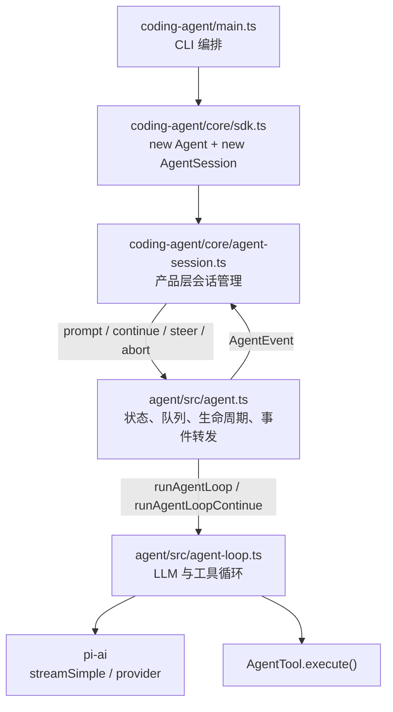
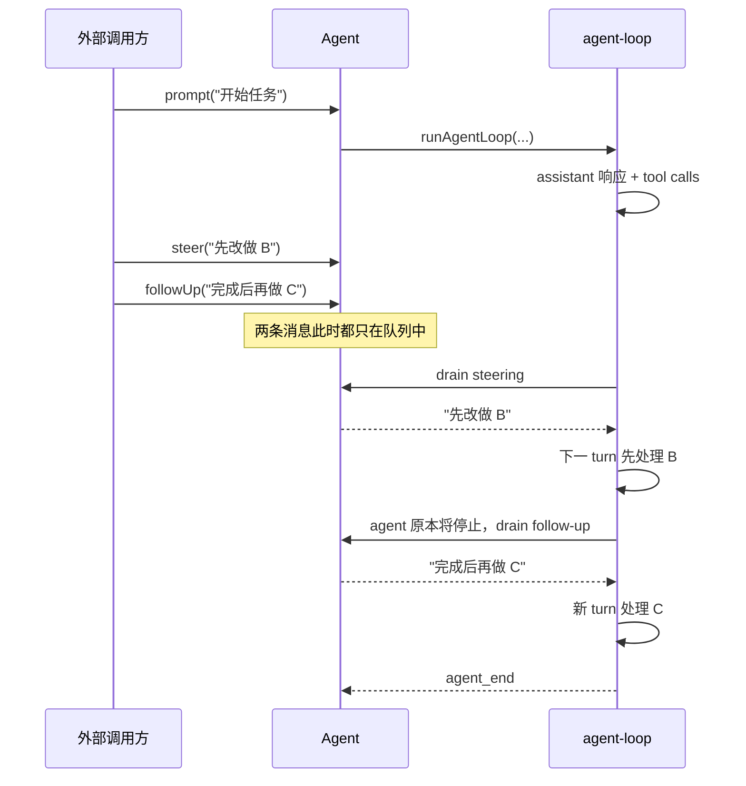
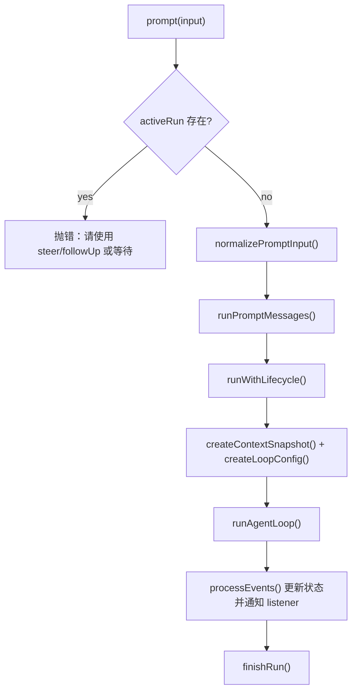
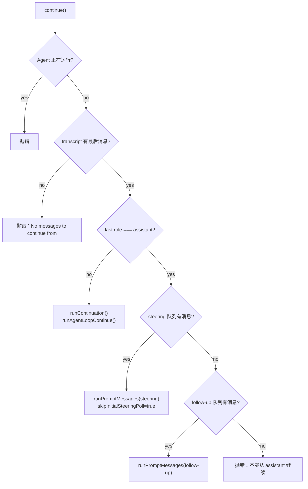

# `packages/agent/src/agent.ts` 学习指南

> 适合读者：已经学完 `packages/coding-agent/src/main.ts`、`src/core/sdk.ts`、`src/core/agent-session.ts`，准备进入 agent runtime 层的开发者。

## 1. 先用一句话理解它

`agent.ts` 定义了一个有状态的 `Agent` 控制器：它保存对话、模型、工具和运行状态，接收 `prompt()` / `continue()` / `steer()` 等外部命令，再把真正的 LLM 与工具循环交给 `agent-loop.ts` 执行。

可以把两个文件的分工记成：

| 文件 | 角色 | 主要问题 |
| --- | --- | --- |
| `agent.ts` | 有状态控制器 / 对外 API | 现在能否启动？状态怎么更新？消息怎么排队？怎么取消？事件怎么通知上层？ |
| `agent-loop.ts` | 无长期状态的执行引擎 | 什么时候调 LLM？怎么执行 tool call？什么时候进入下一 turn？什么时候结束？ |

`agent.ts` 本身不负责 CLI 参数、session JSONL 持久化、TUI 渲染、压缩策略，也不实现各模型 provider 的网络协议。

## 2. 它在你已经学过的主链路中的位置



对应已经看过的代码：

- `sdk.ts` 中的 `new Agent({...})` 注入 model、`streamFn`、上下文转换、队列模式、transport 等能力。
- `AgentSession` 用 `agent.subscribe(...)` 接收事件，再完成持久化、扩展 hook、UI 事件等工作。
- `AgentSession._runAgentPrompt()` 先调 `agent.prompt()`，产品层如果判定需要重试或压缩后续跑，再调 `agent.continue()`。
- 模型、thinking level、system prompt、tools 的切换，在上层通过 `agent.state` 修改。

## 3. 文件的整体结构

```text
agent.ts
├─ defaultConvertToLlm()       默认消息过滤器
├─ EMPTY_USAGE / DEFAULT_MODEL 失败消息和默认状态的占位值
├─ MutableAgentState           内部可变状态类型
├─ createMutableAgentState()   创建状态
├─ AgentOptions                构造器注入点
├─ PendingMessageQueue         steering/follow-up 共用队列
├─ ActiveRun                   当前运行的 promise + abort controller
└─ Agent
   ├─ 状态与配置
   ├─ subscribe()
   ├─ steer() / followUp() / clear*()
   ├─ abort() / waitForIdle() / reset()
   ├─ prompt() / continue()
   ├─ normalizePromptInput()
   ├─ runPromptMessages() / runContinuation()
   ├─ createContextSnapshot() / createLoopConfig()
   ├─ runWithLifecycle() / handleRunFailure() / finishRun()
   └─ processEvents()
```

## 4. 核心状态：`AgentState`

`Agent` 的核心就是 `_state`。对外通过 `agent.state` 暴露为 `AgentState`：

| 字段 | 含义 | 谁主要修改 |
| --- | --- | --- |
| `systemPrompt` | 每次模型请求使用的系统提示词 | `AgentSession` / 调用方 |
| `model` | 后续 turn 使用的模型 | `AgentSession` / 调用方 |
| `thinkingLevel` | `off` 或 `minimal` / `low` / `medium` / `high` / `xhigh` | `AgentSession` / 调用方 |
| `tools` | 当前可用的 `AgentTool[]` | `AgentSession` / 调用方 |
| `messages` | 完整 transcript，包括 user、assistant、toolResult 及上层扩展消息 | 事件 reducer 与上层 |
| `isStreaming` | 一次 prompt/continuation 是否仍在运行 | `Agent` 内部 |
| `streamingMessage` | 当前正在流式生成的 assistant 部分消息 | `processEvents()` |
| `pendingToolCalls` | 当前正在执行的 tool call id 集合 | `processEvents()` |
| `errorMessage` | 最近一次失败/中止 assistant turn 的错误 | `processEvents()` |

### 4.1 为什么又有 `MutableAgentState`

`AgentState` 将运行时字段声明为 `readonly`，例如 `isStreaming`。但 `Agent` 内部必须更新它们，所以代码使用：

```ts
type MutableAgentState = Omit<AgentState, /* 运行时只读字段 */> & {
  // 将这些字段重新定义为可变
};
```

这是“对外类型只读，对内可写”的 TypeScript 实现，不是运行时的真正冻结。

### 4.2 `tools` 和 `messages` 的数组复制语义

`createMutableAgentState()` 用闭包保存 `tools` 与 `messages`，setter 会执行 `slice()`：

```ts
agent.state.messages = externalMessages;
```

赋值后，Agent 保存的不是 `externalMessages` 这个数组容器本身，因此外部后续对原数组 `push()` 不会影响 Agent。

但要注意两点：

1. 这只是顶层浅复制，数组内的 message/tool 对象没有深拷贝。
2. getter 返回内部数组本身，所以 `agent.state.messages.push(...)` 确实会直接改变 transcript。

## 5. 构造器与 `AgentOptions`

`AgentOptions` 可分成六类：

### 5.1 初始状态

- `initialState`：初始 system prompt、model、thinking level、tools 和 messages。
- 不允许传入 `isStreaming`、`streamingMessage`、`pendingToolCalls`、`errorMessage`，因为它们必须由运行时管理。
- 没有模型时使用 `DEFAULT_MODEL`，其 id/provider 都是 `unknown`，它只是保证状态结构完整的占位模型，不代表真能发请求。

### 5.2 LLM 边界适配

- `streamFn`：实际发起模型流式请求，默认是 `streamSimple`。`sdk.ts` 注入了包含鉴权、重试参数、header 合并的自定义实现。
- `convertToLlm`：把应用层 `AgentMessage[]` 转成 provider 能理解的 `Message[]`。
- `transformContext`：在 `convertToLlm` 之前处理 `AgentMessage[]`，可用于裁剪、注入外部上下文等。
- `getApiKey`：每次 LLM 请求时动态获取 key，适合会过期的 token。
- `onPayload` / `onResponse`：provider 请求与响应的观察/改写点。

默认 `defaultConvertToLlm()` 只保留 `user`、`assistant`、`toolResult` 三种角色，上层自定义 UI 消息不会被直接发给模型。

### 5.3 Tool 扩展点

- `beforeToolCall`：参数准备和 schema 校验后、工具执行前调用；可用 `{ block: true }` 阻止工具。
- `afterToolCall`：工具执行后调用；可替换 result 的 `content`、`details`、`isError`、`terminate`。
- `toolExecution`：多个 tool call 默认 `parallel`，也可设为 `sequential`。单个 tool 还可通过自身 `executionMode` 要求串行。

### 5.4 Turn 间更新

- `prepareNextTurnWithContext(context, signal)`：新 API，可查看已完成的 turn 与当前上下文，并为下一 turn 替换 context/model/thinking level。
- `prepareNextTurn(signal)`：保留的旧 API，没有 turn context。
- 两者都存在时，优先 `prepareNextTurnWithContext`。

### 5.5 队列策略

- `steeringMode`：一次 drain steering 队列的数量。
- `followUpMode`：一次 drain follow-up 队列的数量。
- 可选值都是 `"all"` 或 `"one-at-a-time"`，默认后者。

### 5.6 Provider 运行参数

- `sessionId`：传给 provider，用于支持 cache-aware backend。
- `thinkingBudgets`：不同 thinking level 的 token budget。
- `transport`：默认 `auto`。
- `maxRetryDelayMs`：限制 provider 建议的重试等待。

## 6. `PendingMessageQueue`：两种排队消息的共用实现

`PendingMessageQueue` 是一个很小但很关键的 FIFO 队列：

- `enqueue()`：追加到队尾。
- `hasItems()`：是否还有数据。
- `drain()`：
  - `all`：取出全部并清空。
  - `one-at-a-time`：只取最早的一条。
- `clear()`：清空。

`Agent` 内部有两个独立实例：

| 队列 | 入队 API | drain 时机 | 语义 |
| --- | --- | --- | --- |
| steering | `steer(message)` | 当前 assistant turn 及其 tool call 结束后 | 让正在运行的 agent 下一 turn 转向新指令 |
| follow-up | `followUp(message)` | agent 原本已经要停止时 | 等当前任务自然完成后再处理新任务 |

重要：`steer()` 和 `followUp()` 只入队，不会立即将消息放入 `state.messages`。只有 agent loop 真正 drain 并发出 `message_start` / `message_end` 后，消息才进 transcript。

### 6.1 steering 和 follow-up 的时序差异



## 7. 对外 API 逐个理解

### 7.1 `subscribe(listener)`

订阅 `AgentEvent`，返回 unsubscribe 函数。

关键语义：

- listener 保存在 `Set` 中，按订阅顺序串行调用。
- listener 可以是 async，`Agent` 会 `await` 每个 listener。
- listener 会收到当前 run 的 `AbortSignal`。
- `agent_end` 是 loop 的最后一个事件，但必须等它的 listener 全部 settle，`isStreaming` 才会变为 `false`，`prompt()` 才会 resolve。

因此上层可以在 listener 中安全地持久化事件，并把“持久化完成”算作运行结束的一部分。

### 7.2 `state`、`steeringMode`、`followUpMode`

- `state` 返回 Agent 当前状态。
- 两个 mode 的 getter/setter 直接读写各自队列的 drain 策略。
- 设置变更只影响之后的 drain，不会重排已入队数据。

### 7.3 `steer()` / `followUp()` / `clear*()` / `hasQueuedMessages()`

这些都是队列管理 API。`hasQueuedMessages()` 只说明两个队列至少一个非空，不代表 Agent 正在运行。

### 7.4 `signal` / `abort()` / `waitForIdle()`

- `signal`：当前 run 的 signal；空闲时是 `undefined`。
- `abort()`：调用当前 `AbortController.abort()`；空闲时什么也不做。
- `waitForIdle()`：如果有 run，返回该 run 的 settlement promise；否则立即 resolve。

`abort()` 是协作式取消：Agent 会把 signal 传给 stream、tool 和 hooks，但这些实现也必须观察 signal 才能及时停止。

### 7.5 `reset()`

清除：

- transcript；
- streaming 相关状态；
- pending tool call；
- error message；
- steering 和 follow-up 队列。

它不会重置 system prompt、model、thinking level、tools 和 provider 配置。这更像“清空当前会话运行数据”，不是重新构造 Agent。

### 7.6 `prompt()`

`prompt()` 有三种输入形式：

```ts
await agent.prompt("hello", images);
await agent.prompt(oneAgentMessage);
await agent.prompt([message1, message2]);
```

主流程：



字符串输入会被标准化为：

```ts
{
  role: "user",
  content: [{ type: "text", text: input }, ...images],
  timestamp: Date.now()
}
```

如果直接传入 `AgentMessage` 或数组，`normalizePromptInput()` 不会再复制或校验其内容。

### 7.7 `continue()`

`continue()` 不新建普通 prompt，而是从现有 transcript 继续。

决策逻辑：



为什么 transcript 以 assistant 结尾时通常不能直接 continuation？

LLM 协议一般要求下一次生成前的最后一条输入是 user 或 toolResult。如果已有排队消息，`continue()` 就把它作为新 prompt 启动；否则拒绝无输入地要求 assistant 继续。

`skipInitialSteeringPoll` 是一个容易忽略的细节。当 `continue()` 已经从 one-at-a-time steering 队列取出第一条作为 prompt 时，loop 启动处的第一次 steering poll 必须跳过。否则第二条 steering 会在还没回答第一条之前就被同时注入，破坏 `one-at-a-time` 语义。

## 8. 一次 run 的生命周期

### 8.1 `ActiveRun`

```ts
type ActiveRun = {
  promise: Promise<void>;
  resolve: () => void;
  abortController: AbortController;
};
```

它同时解决三个问题：

1. 用 `activeRun` 作为互斥锁，禁止两个 prompt/continuation 并发运行。
2. 向 `abort()` 和各执行环节提供同一个 signal。
3. 向 `waitForIdle()` 提供一个会在完整收尾后 resolve 的 promise。

### 8.2 `runWithLifecycle()`

这是 prompt 和 continuation 共用的运行外壳：

1. 检查不允许并发 run。
2. 创建 `AbortController` 和 idle promise，写入 `activeRun`。
3. 设置 `isStreaming = true`，清理上一次 streaming/error 状态。
4. `await executor(signal)` 执行底层 loop。
5. 如果抛异常，由 `handleRunFailure()` 将异常归一化为 assistant 失败消息和完整结束事件。
6. `finally` 中执行 `finishRun()`，重置运行时状态、resolve idle promise、清除 `activeRun`。

### 8.3 错误为什么被转成 assistant message

`handleRunFailure()` 构造一条空文本 assistant message，并设置：

- `stopReason = "error"` 或 `"aborted"`；
- `errorMessage = 异常文本`；
- usage 全为 0；
- model/provider/api 来自当前 state。

然后人工发出：

```text
message_start
message_end
turn_end
agent_end
```

这样上层不用为“provider 正常返回错误消息”和“代码直接 throw”维护两套 UI/持久化逻辑。二者都尽量呈现为一次有结尾事件的 assistant turn。

## 9. 快照边界：`createContextSnapshot()` 和 `createLoopConfig()`

### 9.1 Context 快照

`createContextSnapshot()` 会复制：

```ts
{
  systemPrompt,
  messages: state.messages.slice(),
  tools: state.tools.slice()
}
```

这意味着一次 run 的 loop 有自己的顶层数组快照；loop 向该快照追加消息，`Agent` 则通过事件把完成的消息追加到真正 state。

快照不是深拷贝。而且在 run 进行中直接替换 `agent.state.tools` 或 `messages` 数组，不会自动改变已启动 loop 持有的快照。常规做法是让配置变更在下一次 run 生效，或通过 `prepareNextTurnWithContext` 显式替换下一 turn 的 context。

### 9.2 Loop 配置

`createLoopConfig()` 把 Agent 字段组装成 `AgentLoopConfig`，其中几个映射很重要：

- `thinkingLevel === "off"` 转成 `reasoning: undefined`；其它级别原样传入。
- `getSteeringMessages` / `getFollowUpMessages` 被实现为对两个内部队列的 `drain()`。
- 新旧 `prepareNextTurn` API 在这里被统一成 loop 只认识的一个 callback。
- callback 中使用 `this.signal`，因此获得的是当前 active run 的 signal。

## 10. `processEvents()`：Agent 内部的 event reducer

底层 loop 只负责发事件，`Agent` 通过 `processEvents()` 把事件归约为持久状态。

| 事件 | 内部状态更新 |
| --- | --- |
| `message_start` | `streamingMessage = event.message` |
| `message_update` | 用最新 partial message 替换 `streamingMessage` |
| `message_end` | 清空 `streamingMessage`，将完整 message 追加到 transcript |
| `tool_execution_start` | 复制 `pendingToolCalls` Set，加入 id，再整体替换 |
| `tool_execution_end` | 复制 Set，删除 id，再整体替换 |
| `turn_end` | assistant 有 `errorMessage` 时写入 state |
| `agent_end` | 清空 `streamingMessage` |
| 其它事件 | 不更新 Agent 内部状态，但仍通知 listener |

`pendingToolCalls` 每次都创建新 `Set` 而不是就地 `add/delete`，便于上层使用引用变化检测状态更新。

状态更新之后，`processEvents()` 才会串行 `await` 所有 listener。所以 listener 看到事件时，`agent.state` 已经是该事件对应的新状态。

## 11. 一次普通 prompt 的事件顺序

无工具时，典型顺序是：

```text
agent_start
turn_start
message_start(user)
message_end(user)          -> user 写入 state.messages
message_start(assistant)   -> streamingMessage 出现
message_update(assistant)  -> 可发生多次
message_end(assistant)     -> assistant 写入 state.messages
turn_end
agent_end
finishRun                  -> isStreaming=false，activeRun 清除
```

有工具时，assistant 消息结束后会增加：

```text
tool_execution_start
tool_execution_update      -> 工具支持部分结果时可出现多次
tool_execution_end
message_start(toolResult)
message_end(toolResult)    -> toolResult 写入 state.messages
turn_end
turn_start                 -> 如果需要将 tool result 再发给 LLM
...
```

`turn` 是“一次 assistant 响应 + 该响应产生的 tool calls/results”；`run` 则是一次 `prompt()` 或 `continue()` 的完整执行，一个 run 可以包含多个 turn。

## 12. 并发和时序上最需要注意的点

### 12.1 同一 Agent 不允许并发 run

`activeRun` 存在时，再调 `prompt()` 或 `continue()` 会抛错。运行中的用户新输入应使用 `steer()` 或 `followUp()`。

### 12.2 listener 会对整个 loop 施加背压

每个事件的 listener 都会被 await。好处是顺序严格、持久化可靠；代价是慢 listener 会直接拖慢 stream 和 tool event 处理。

不要在当前 run 的 listener 内 `await agent.waitForIdle()`：该 listener 本身就是 run settle 的一部分，会形成循环等待。

### 12.3 `agent_end` 不等于立即 idle

listener 收到 `agent_end` 时：

- `isStreaming` 仍是 `true`；
- `activeRun` 仍存在；
- 当前 `agent_end` listener 全部完成后，才会进入 `finishRun()`。

### 12.4 abort 后也要等待收尾

`abort()` 只是发出取消信号。要等运行真正停止，使用：

```ts
agent.abort();
await agent.waitForIdle();
```

## 13. 与 `AgentSession` 的边界

`Agent` 有意保持为通用 runtime，所以许多产品能力在 `AgentSession` 中：

| 能力 | `Agent` 的责任 | `AgentSession` 的责任 |
| --- | --- | --- |
| 对话记录 | 维护内存 `state.messages` | 写入/恢复 session JSONL |
| 事件 | 产生并转发 `AgentEvent` | 转换为产品事件、UI 通知、扩展 hook |
| 重试 | 提供 `continue()` | 判断是否可重试、等待和追加重试信息 |
| 压缩 | 提供状态和 continuation 能力 | 检测上下文、执行 compaction、替换 messages |
| 模型切换 | 保存 `state.model` | 验证模型、持久化变更、调整 thinking level |
| 工具 | 快照 tools，将执行交给 loop | 构建工具注册表、选择活跃工具、重建 system prompt |
| 中途输入 | 管理 steering/follow-up 队列 | 根据 UI/扩展语义决定调哪个 API |

一个很重要的认识是：`Agent.prompt()` resolve 只表示 agent-core 的这次 run 完成。`AgentSession` 之后还可能因自动重试、压缩等产品策略再调 `agent.continue()`。

## 14. 容易误解或踩坑的地方

1. **`agent.ts` 不是 agent 主循环全部实现。** 它是 wrapper/controller；工具执行、多 turn 条件和 provider stream 消费都在 `agent-loop.ts`。
2. **`readonly` 是类型层保护。** 返回的 state 实际仍是内部对象，没有 `Object.freeze()`。
3. **数组 setter 只浅复制。** 数组容器隔离，元素对象仍共享引用。
4. **队列中的消息还不在 transcript。** 要等 loop drain 后才通过消息事件入 state。
5. **`continue()` 并不是无条件“让 AI 继续说”。** 它要求合法的 transcript 尾部，或有排队用户消息可先注入。
6. **运行中不能再调 `prompt()`。** 用 steering/follow-up 表达新输入的时序意图。
7. **取消是协作式的。** 自定义 stream、tool、hook 忽略 signal 时，`abort()` 不会凭空终止它们。
8. **listener 属于运行主链。** 它不是 fire-and-forget；慢 listener 会施加背压，异常 listener 也可能破坏正常事件流，因此 listener 内应自行做好错误处理。
9. **`reset()` 不是恢复构造器默认值。** 模型、工具、system prompt 等保留。
10. **当前 run 使用快照。** 运行中直接改 state 不应被当成修改当前 loop 的可靠方式。

## 15. 建议的源码阅读顺序

第一遍建立框架：

1. `Agent` 字段和 constructor。
2. `prompt()` → `runPromptMessages()` → `runWithLifecycle()`。
3. `createContextSnapshot()` 和 `createLoopConfig()`。
4. `processEvents()`。
5. `continue()` 的分支。
6. `PendingMessageQueue` 和 steering/follow-up API。

第二遍跟进底层：

1. 打开 `types.ts`，看 `AgentState`、`AgentLoopConfig`、`AgentEvent`、`AgentTool`。
2. 打开 `agent-loop.ts`，跟 `runAgentLoop()` → `runLoop()` → `streamAssistantResponse()`。
3. 再看 `executeToolCalls()` 及 sequential/parallel 分支。
4. 回到 `AgentSession._handleAgentEvent`，观察产品层如何消费事件。

## 16. 用一段伪代码压缩整个文件

```ts
class Agent {
  state = createMutableAgentState();
  steeringQueue = new Queue();
  followUpQueue = new Queue();
  activeRun?: { promise, abortController };

  async prompt(input) {
    ensureIdle();
    const prompts = normalize(input);
    await runWithLifecycle(signal =>
      runAgentLoop(
        prompts,
        snapshotOfState(),
        configBackedByAgentAndQueues(),
        event => processEvents(event),
        signal,
        streamFn,
      )
    );
  }

  async continue() {
    ensureIdleAndTranscriptExists();
    if (lastMessageIsAssistant()) {
      // assistant 尾部需先注入排队 user 消息
      runQueuedSteeringOrFollowUpAsPrompt();
    } else {
      runAgentLoopContinue(...);
    }
  }

  async processEvents(event) {
    reduceEventIntoState(event);
    for (const listener of listeners) await listener(event, activeSignal);
  }
}
```

## 17. 学完后的自测题

### 基础理解

1. `Agent` 和 `agent-loop` 各自负责什么？
2. 为什么 `isStreaming` 对外 readonly，Agent 内部却可以修改？
3. 给 `state.messages` 赋数组和对 `state.messages.push()` 有什么不同？
4. `message_update` 和 `message_end` 对 state 的影响有什么不同？
5. 为什么 `agent_end` listener 运行时 `isStreaming` 仍是 true？

### 流程理解

6. 用户在 agent 执行 tool 时输入“别改 A 了，改 B”，应调 `prompt()`、`steer()` 还是 `followUp()`？为什么？
7. 用户说“当前任务完成后再跑测试”，应放入哪个队列？
8. `one-at-a-time` 模式下，为什么 assistant 尾部的 `continue()` 要设 `skipInitialSteeringPoll`？
9. 一次 prompt 为什么可能包含多个 turn？
10. provider 直接 throw 时，`Agent` 如何尽量保持完整的事件序列？

### 设计理解

11. 为什么 listener 采用 await，而不是简单 fire-and-forget？代价是什么？
12. 为什么 loop 使用 state 的顶层快照，但 Agent 又要通过事件同步 transcript？
13. 为什么自动重试和压缩策略放在 `AgentSession`，而不是 `Agent` 中？
14. 如果自定义 tool 忽略 `AbortSignal`，用户调 `abort()` 后会出现什么现象？

## 18. 最终心智模型

学完这个文件后，应该在脑中保留以下模型：

> `Agent` 是一个串行运行的、事件驱动的有状态控制器。它用 state 保存长期对话状态，用 context/config 快照启动一次 loop，用 `processEvents()` 把 loop 结果同步回 state，用可 await 的 listener 把变化交给上层，用 steering/follow-up 队列安全接收运行中的新输入，用 `AbortController` 统一取消整条执行链。

下一个最自然的学习文件是 `packages/agent/src/agent-loop.ts`，因为 `agent.ts` 中的所有运行命令最终都在那里变成真正的 LLM 请求和工具执行。
