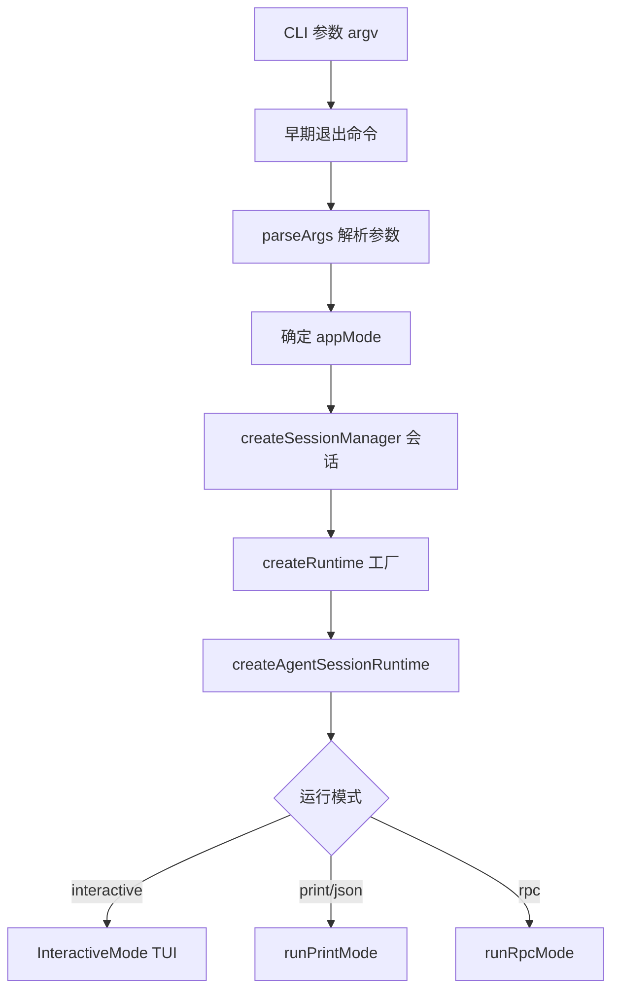
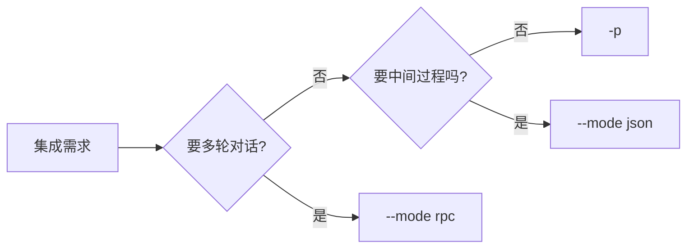

# `main.ts` 学习指南

这是 **pi coding agent CLI 的主入口**。文件头注释写得很清楚：它负责 **解析 CLI 参数**，把它们转成 `createAgentSession()` 所需的选项；真正的 agent 逻辑在 SDK / core 层。

实际调用链：`cli.ts` → `main(process.argv.slice(2))`。

---

## 整体架构




`main.ts` 是 **编排层（orchestrator）**：不实现 AI 对话本身，而是把 CLI 意图组装成 `runtime`，再交给三种模式之一运行。

---


## 文件结构（四块）


| 区域       | 行号               | 职责                              |
| -------- | ---------------- | ------------------------------- |
| 工具函数     | 58–462           | stdin 读取、诊断输出、模式判断、会话解析、选项构建    |
| 类型定义     | 142–147, 464–466 | `ResolvedSession`、`MainOptions` |
| `main()` | 468–854          | 完整启动流程                          |
| 模式分发     | 806–853          | interactive / print / rpc       |


---


## 1. 工具函数层


### 输入与模式

- `readPipedStdin()`（58–75）：若 stdin 不是 TTY（人类键盘）（例如 `echo "hi" \| pi`），就读取管道内容作为初始 prompt。
- `resolveAppMode()`（100–111）：决定运行模式：
  - `--mode rpc` → `rpc`
  - `--mode json` 或 `-p` / 非 TTY → `print` / `json`
  - 否则 → `interactive`（TUI）

pi 有四种运行模式，由 `resolveAppMode()` 判定后，在 `main()` 末尾分发给对应模块：


| 模式            | 典型场景                  | 入口                                  |
| ------------- | --------------------- | ----------------------------------- |
| `interactive` | 直接运行 `pi`             | `InteractiveMode.run()`             |
| `print`       | `pi -p "问题"`、管道输入     | `runPrintMode()`，stdout 只输出最终文本     |
| `json`        | `pi --mode json "问题"` | `runPrintMode()`，stdout 输出 JSON 事件流 |
| `rpc`         | IDE 插件、自动化、多轮集成       | `runRpcMode()`，stdin/stdout JSON 协议 |


**Print 与 JSON** 同属单次运行：`runPrintMode`（`src/modes/print-mode.ts`）接收 prompt 后执行一轮对话并退出。`-p` 模式下 stdout 仅写入助手最终回复；`--mode json` 则订阅 session 事件，将 `AgentSessionEvent` 逐行序列化为 JSONL 输出，便于脚本解析 tool call、流式 delta 等中间过程。详见 `docs/json.md`。

**RPC** 面向需要长期嵌入 pi 的外部程序。进程启动后常驻，客户端经 stdin 发送 JSON 命令（`prompt`、`abort`、`set_model` 等），经 stdout 接收响应与 agent 事件流。文档见 `docs/rpc.md`；TypeScript 客户端可参考 `src/modes/rpc/rpc-client.ts`，独立入口为 `rpc-entry.ts`（等价于 `main(["--mode", "rpc", ...argv])`）。Node/TS 应用若在同一进程内集成，文档更推荐直接使用 `AgentSession` SDK，而非 spawn 子进程。IM 机器人等场景可在应用层通过 RPC 或 SDK 对接，但 pi 本身不提供 IM 集成。

三种非交互模式的选择：




非交互模式不会弹出 project trust 提示，而是按全局 `defaultProjectTrust` 处理；可用 `--approve` / `--no-approve` 单次覆盖（见 `docs/settings.md`）。

### 会话管理

- `resolveSessionPath()`（163–189）：把 `--session` 参数解析成 `.jsonl` 文件路径。支持：
  - 直接路径
  - 当前项目的 session ID（完整或前缀）
  - 全局搜索其他项目的 session
- `createSessionManager()`（264–350）：根据 CLI 标志创建 `SessionManager`：


| 标志               | 行为                           |
| ---------------- | ---------------------------- |
| `--no-session`   | 内存会话，不落盘                     |
| `--fork <id>`    | 从已有 session 分叉               |
| `--session <id>` | 打开指定 session（跨项目会询问是否 fork）  |
| `--resume`       | 交互式选择 session                |
| `--continue`     | 继续最近 session                 |
| `--session-id`   | 指定新 session 的 ID             |
| 默认               | `SessionManager.create()` 新建 |


## **背景：session 是树，不是单线**

pi 的 session 存成 JSONL，每条记录有 `id` 和 `parentId`，形成 **对话树**：

```
├─ user: "帮我重构 auth"
│  └─ assistant: "好的，方案 A..."
│     ├─ user: "试方案 A"        ← 分支 1
│     │  └─ assistant: "..."
│     └─ user: "改试方案 B"      ← 分支 2
│        └─ assistant: "..."
```

- `/tree`：在同一文件里跳到某个节点继续，不新建文件
- `/fork`、`/clone`、`--fork`：新建一个 session 文件

文档对比（`docs/sessions.md`）：


|      | `/tree`       | `/fork`          | `/clone`         |
| ---- | ------------- | ---------------- | ---------------- |
| 结果   | 同一 session 文件 | **新** session 文件 | **新** session 文件 |
| 起点   | 树中任意节点        | 选一条 **用户消息**     | 当前活跃分支           |
| 典型用途 | 在同一文件里探索分支    | 从早期 prompt 另开一条线 | 复制当前进度再改         |


### Agent 选项构建

- `buildSessionOptions()`（352–448）：把 CLI 参数转成 `CreateAgentSessionOptions`：
  - 模型：`--model`、`--provider`、`--thinking`
  - 模型范围：`--models`（Ctrl+P 切换）
  - 工具：`--no-tools`、`--tools`、`--exclude-tools`

---


## 2. `main()` 启动流程（核心）

按执行顺序拆解：

### Phase 0：环境与早期退出

```468:501:packages/coding-agent/src/main.ts
export async function main(args: string[], options?: MainOptions) {
	resetTimings();
	const offlineMode = args.includes("--offline") || isTruthyEnvFlag(process.env.PI_OFFLINE);
	// ...
	if (await handlePackageCommand(args, { extensionFactories: options?.extensionFactories })) {
		// pi update / install 等包管理命令
	}
	if (await handleConfigCommand(args, { extensionFactories: options?.extensionFactories })) {
		return;
	}
```

- 离线模式、Windows 自更新清理
- HTTP 代理配置
- `handlePackageCommand` / `handleConfigCommand`：子命令（如 `pi update`）在此直接退出


### Phase 1：参数解析与元命令

```503:532:packages/coding-agent/src/main.ts
	const parsed = parseArgs(args);
	// ...
	if (parsed.version) { /* 打印版本 */ }
	if (parsed.export) { /* 导出 session 为 HTML */ }
```

- `--help`、`--list-models`、`--export` 等在此处理


### Phase 2：Session 与 cwd 解析

```562:594:packages/coding-agent/src/main.ts
	let sessionManager = await createSessionManager(parsed, cwd, sessionDir, startupSettingsManager);
	const missingSessionCwdIssue = getMissingSessionCwdIssue(sessionManager, cwd);
	// 若 session 的 cwd 目录不存在，交互模式会提示用户选择
```

要点：**先确定 session，再确定最终 cwd**。因为 `--session` 可能指向另一个项目的 session，项目级设置、扩展、模型都要在正确 cwd 下加载。

### Phase 3：Runtime 工厂（最重的一块）

```610:734:packages/coding-agent/src/main.ts
	const createRuntime: CreateAgentSessionRuntimeFactory = async ({ cwd, agentDir, sessionManager, ... }) => {
		// 1. 项目信任（project trust）
		// 2. createAgentSessionServices（扩展、技能、主题、模型注册表）
		// 3. buildSessionOptions（模型、工具）
		// 4. createAgentSessionFromServices（真正创建 agent session）
	};
```

`createRuntime` 是 **工厂函数**，交给 `createAgentSessionRuntime` 管理生命周期（含 cwd 切换时的 reload）。内部做了：

1. **Project Trust**：加载扩展前询问是否信任项目
2. **Resource Loader**：扩展、skills、prompt templates、themes
3. **Model Registry + Auth**：模型列表与 API key
4. **Session Options**：CLI 模型/工具配置
5. `createAgentSessionFromServices`：创建可对话的 `session`


### Phase 4：初始消息与主题

```761:778:packages/coding-agent/src/main.ts
	let stdinContent = await readPipedStdin();
	const { initialMessage, initialImages } = await prepareInitialMessage(...);
	initTheme(settingsManager.getTheme(), appMode === "interactive");
```

- 合并：CLI 消息、`@file` 附件、管道 stdin
- 初始化 TUI 主题


### Phase 5：模式分发

```806:853:packages/coding-agent/src/main.ts
	if (appMode === "rpc") {
		await runRpcMode(runtime);
	} else if (appMode === "interactive") {
		await interactiveMode.run();  // TUI
	} else {
		await runPrintMode(runtime, { mode, messages, initialMessage, initialImages });
	}
```


| 模式            | 典型场景              | 入口                              |
| ------------- | ----------------- | ------------------------------- |
| `interactive` | 直接运行 `pi`         | `InteractiveMode.run()`         |
| `print`       | `pi -p "问题"`、管道输入 | `runPrintMode()`                |
| `json`        | `--mode json`     | `runPrintMode` + JSON 输出        |
| `rpc`         | 程序化集成             | `runRpcMode()`，stdin 走 JSON-RPC |


---


## 3. 关键设计模式


### 工厂 + 延迟创建

`createRuntime` 不立即创建 session，而是作为工厂交给 `createAgentSessionRuntime`。这样在 **cwd 变化**（例如打开其他项目的 session）时可以 **reload** 而不重启整个进程。

> **工厂** = 不是一次建好 session 就结束。`main.ts` 把「怎么按 cwd 建 session」写成函数 `createRuntime`，交给 `createAgentSessionRuntime` 保存。
>
> **启动时**：工厂跑一次，得到第一个 `AgentSession` + `services`（设置、扩展、模型等）。
>
> **换 session / cwd 时**（`/resume`、`/fork`、打开别的项目 session）：
>
> 1. 拆掉旧 session（`teardownCurrent`）
> 2. **再调同一个工厂**，传入新 `cwd` + 新 `SessionManager`
> 3. 按新 cwd 重建 settings、扩展、project trust、模型
> 4. `apply` 换上新 session
>
> **为啥要这样**：很多资源绑 cwd。A 项目 session 的扩展、`.pi/settings` 和 B 项目不同。不能只换对话文件，要整套 reload。
>
> **reload 不重启进程**：TUI / RPC 进程还在。用户还在同一个 pi 里，只是底层 session 和 cwd 绑定的服务换了一套。不用 `exit` 再 `pi` 启动。
>
> 类比：`createRuntime` = 菜谱。`AgentSessionRuntime` = 厨房。第一次按菜谱做菜。换项目 = 同一厨房，同一菜谱，换食材重做，不拆厨房。


### 诊断（Diagnostics）而非 throw

模型解析失败、扩展加载失败等多以 `{ type: "warning" | "error", message }` 收集，最后统一 `reportDiagnostics()` 输出，再决定是否 `process.exit(1)`。**软错误收集 + 批量报告**，比每错一处就 crash 更利于排查。

### 两阶段 SettingsManager

- **bootstrap**：`projectTrusted: false`，仅用于 session 查找
- **runtime**：在最终 cwd 下创建，含完整项目设置

> **核心问题**：启动时还不知道最终 cwd。
>
> 你在 `/project-A` 跑 `pi --resume`，可能选中 `/project-B` 的旧 session。项目设置、扩展、skills 都绑 **session 的 cwd**，不是启动时 `process.cwd()`。
>
> **第一阶段（bootstrap / startup）** — 用**启动目录**建 `SettingsManager`：
>
> `projectTrusted: false` = **不加载项目级设置**（`.pi/settings.json`、项目扩展等）。此时还没决定信任哪个项目，也不该提前加载。
>
> 这个阶段的 manager 只做轻量事：
>
> - 读**全局**设置（HTTP 代理）
> - 查 `sessionDir`
> - 跑首次设置 UI
> - 帮 `--resume` / `--session` 选 session
>
> 相当于「选 session 用的临时配置」，不是最终运行环境。
>
> ---
>
> **第二阶段（runtime）** — session 定下来后，在 **session 真实 cwd** 重建：
>
> 这里的 `cwd` 是 `sessionManager.getCwd()`，可能是 B 项目。`projectTrusted` 也在这时才算准（信任提示、`trust.json`、`--approve` 等）。
>
> 这时才加载完整项目设置：项目扩展、skills、prompt templates、项目模型配置等。
>
> ---
>
> **为啥分两次**：先选 session，再按 session 所在项目加载配置。一次建错 cwd 的 `SettingsManager`，扩展和设置就全错项目了。


### 性能计时

各处 `time("...")` + 末尾 `printTimings()`，配合 `PI_STARTUP_BENCHMARK` 做启动性能分析。

---


## 4. 与周边模块的关系

```
main.ts
├── cli/          参数解析、文件处理、首次启动 UI
├── core/         agent session、auth、model、session manager
├── modes/        interactive / print / rpc 三种运行模式
├── migrations.ts 配置迁移
└── config.ts     路径、版本号
```

`main.ts` **不写业务逻辑**，只做 **胶水**：CLI → Session → Services → Mode。

---


## 5. 常用 CLI 在代码中的落点


| 用户命令                          | 对应逻辑                                      |
| ----------------------------- | ----------------------------------------- |
| `pi`                          | `resolveAppMode` → interactive            |
| `pi -p "hello"`               | print mode                                |
| `pi --mode json "hello"`      | print mode，`runPrintMode` JSON 事件流        |
| `pi --mode rpc`               | `runRpcMode()`，stdin JSON 命令              |
| `pi --continue`               | `SessionManager.continueRecent`           |
| `pi --session abc123`         | `resolveSessionPath` → open               |
| `pi --fork abc123`            | `SessionManager.forkFrom`                 |
| `pi --model anthropic/claude` | `buildSessionOptions` → `resolveCliModel` |
| `pi -ne`（无扩展）                 | `parsed.noExtensions` → resourceLoader    |
| `echo "fix bug"               | pi`                                       |


---


## 6. 阅读建议

1. 从 `main()` **第 468 行** 顺读一遍，用 `time("...")` 标记作 checkpoint。
2. 重点看 `createSessionManager` 和 `createRuntime`，理解 session 与 cwd 的关系。
3. 再读 `buildSessionOptions`，理解 CLI 如何映射到 agent 配置。
4. 最后看 `modes/index.ts` 里的三种模式实现。

