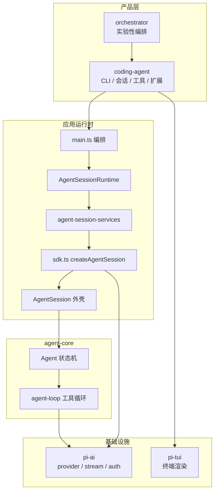
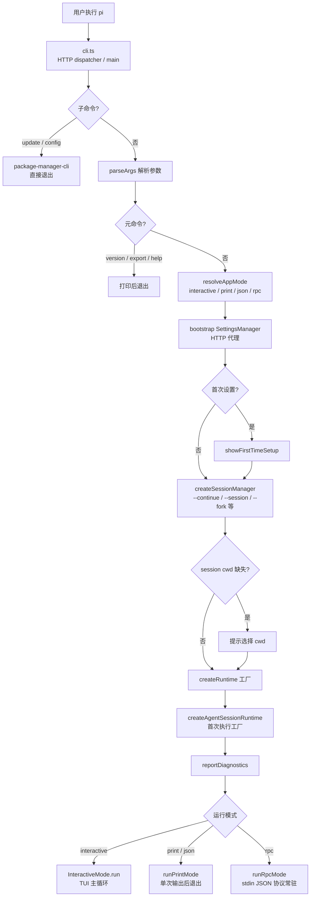
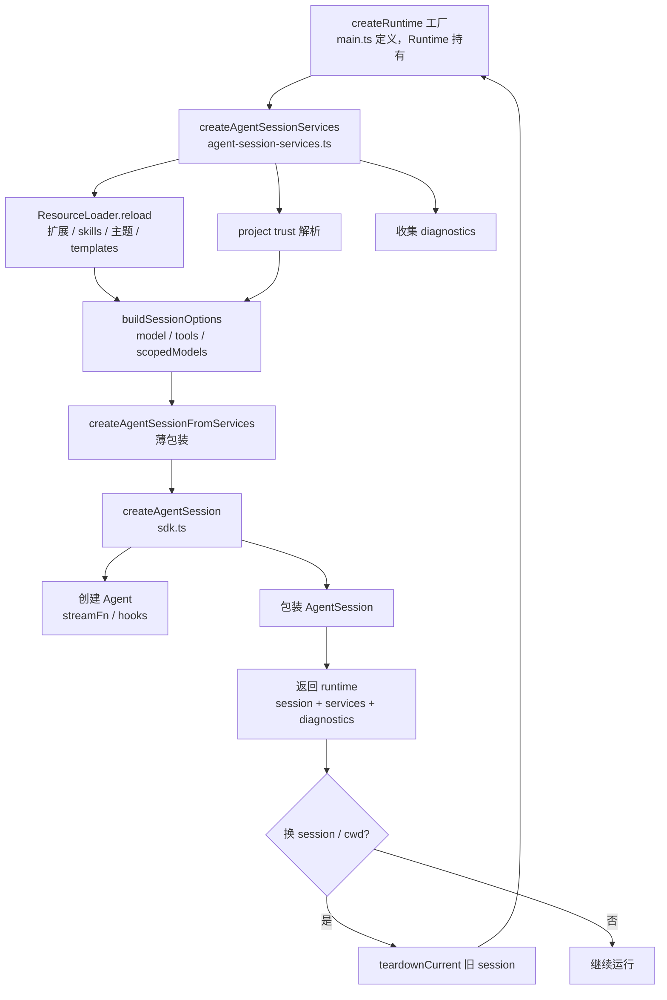
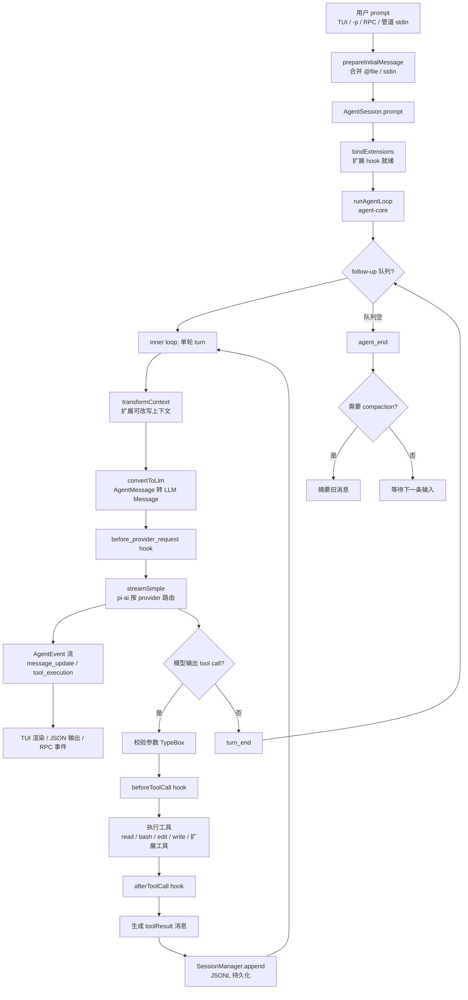
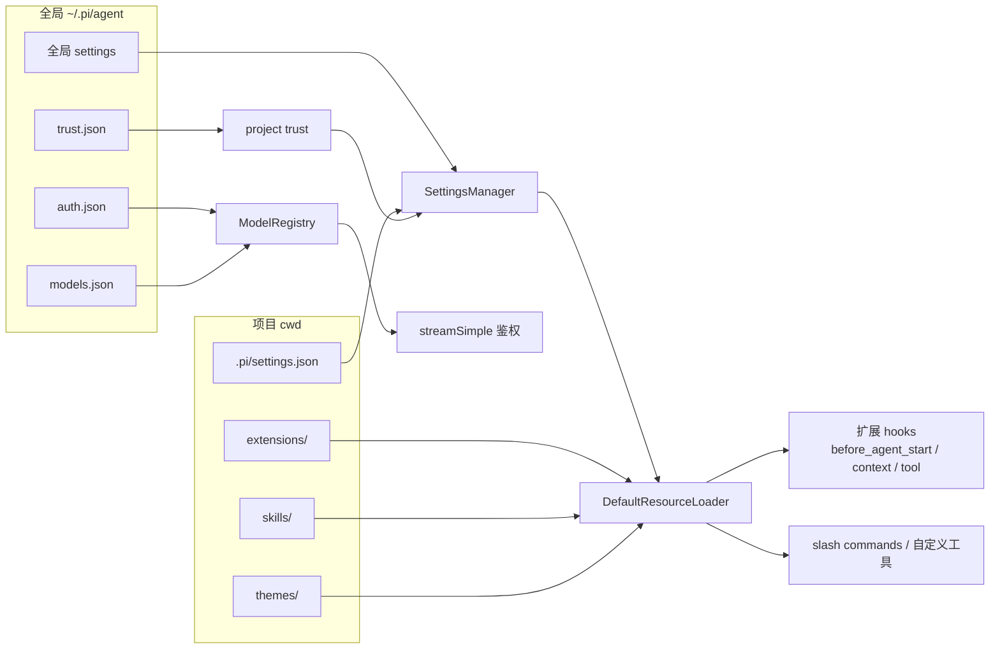

# Pi 项目小白 Onboarding

这份文档面向第一次接触 Pi 代码库的人。目标不是一次读完所有细节，而是先建立项目地图、运行方式和核心链路，再通过题目检查是否理解了关键点。

## 1. 项目一句话

Pi 是一个 terminal coding agent harness。它把“多模型接入、agent 循环、工具调用、会话管理、终端 UI、扩展机制”拆成几个包，让用户可以在终端里和模型协作完成代码任务。

顶层 README 里最重要的三个定位：

- `@earendil-works/pi-coding-agent`：用户直接使用的 CLI。
- `@earendil-works/pi-agent-core`：agent runtime，负责消息状态、模型 streaming、工具调用循环。
- `@earendil-works/pi-ai`：统一 LLM provider API，屏蔽 OpenAI、Anthropic、Google 等差异。
- `@earendil-works/pi-tui`：终端 UI 框架，负责 interactive mode 的渲染和输入。

## 2. 仓库结构

```text
.
├── README.md
├── package.json
├── test.sh
├── pi-test.sh
├── packages
│   ├── ai
│   ├── agent
│   ├── coding-agent
│   ├── tui
│   └── orchestrator
└── scripts
```

核心包说明：

| 包 | 作用 | 建议先看 |
| --- | --- | --- |
| `packages/coding-agent` | CLI、交互模式、会话、工具、扩展、设置 | `src/main.ts`, `src/core/sdk.ts`, `src/core/agent-session.ts` |
| `packages/agent` | agent 状态机、事件流、工具执行循环 | `src/agent.ts`, `src/agent-loop.ts`, `src/types.ts` |
| `packages/ai` | provider/model/auth/API 协议适配 | `src/index.ts`, `src/models.ts`, `src/providers/*`, `src/api/*` |
| `packages/tui` | terminal UI 基础组件和渲染 | `src/tui.ts`, `src/components/editor.ts`, `src/keybindings.ts` |
| `packages/orchestrator` | 实验性 orchestrator | `src/index.ts`, `src/cli.ts` |

### 建议先看文件说明

#### `packages/coding-agent`

- **`src/main.ts`** — CLI 总入口。解析命令行参数（`parseArgs`），处理首次启动、项目信任、会话选择、模型解析，组装 `createAgentSession()` 所需选项，再按模式分发到 interactive / print / rpc。产品层编排，不直接实现 agent 循环。
- **`src/core/sdk.ts`** — 对外 SDK 入口。`createAgentSession()` 在这里把 `AuthStorage`、`ModelRegistry`、`SettingsManager`、`SessionManager`、内置工具、扩展、`Agent` 实例拼成可用的 `AgentSession`。外部嵌入（如 OpenClaw）通常从这里接入。
- **`src/core/agent-session.ts`** — 会话核心抽象，interactive / print / rpc 共用。封装 agent 状态读写、事件订阅与自动持久化、模型/思考级别切换、压缩（compaction）、bash 执行、分支切换（`/tree`）、扩展钩子。各运行模式在此之上加自己的 I/O。

#### `packages/agent`

- **`src/agent.ts`** — `Agent` 类：对外 API（`prompt`、`steer`、`followUp`、`abort`、`setModel` 等）。维护 `AgentState`，注册 `streamFn`、tool 钩子、steering/follow-up 队列，把调用转给 `agent-loop`。
- **`src/agent-loop.ts`** — agent 主循环实现。流程：user 消息 → 调 LLM stream → 解析 tool call → 执行工具 → 写 tool result → 继续直到结束。全程用 `AgentMessage`，仅在调模型边界转成 `Message[]`；通过 `AgentEvent` 流向外推事件。
- **`src/types.ts`** — agent 层类型契约。定义 `AgentState`、`AgentEvent`、`AgentTool`、`StreamFn`、`QueueMode`、`BeforeToolCall`/`AfterToolCall` 钩子等，是理解事件流和扩展点的类型地图。

#### `packages/ai`

- **`src/index.ts`** — 包公共导出入口。导出核心类型、auth、`models.ts`、工具函数；不直接拉全量 provider。具体 provider 走 `@earendil-works/pi-ai/providers/*`，旧版全局 API 走 `compat`。
- **`src/models.ts`** — provider 运行时抽象。`Provider` 接口（id、auth、模型列表、`stream`）、`Models` 集合（多 provider 管理、鉴权解析、`streamSimple` 统一入口）。选模型、拿 API key、发起 stream 的核心枢纽。
- **`src/providers/*`** — 各厂商 provider 工厂。每个文件把某家 LLM（Anthropic、OpenAI、Google…）的 baseUrl、auth 方式、模型目录、对应 API 实现绑在一起。例：`anthropic.ts` = Anthropic 的 `Provider` 配置。
- **`src/api/*`** — 各 API 协议的 stream 实现。把 Pi 统一的 `Context`/`Message` 转成厂商 HTTP/WebSocket 请求，再把响应解析成 `AssistantMessageEventStream`。例：`anthropic-messages.ts` 对接 Anthropic Messages API。

#### `packages/tui`

- **`src/tui.ts`** — TUI 引擎。差分渲染、组件树、焦点、键盘输入、终端尺寸变化、硬件光标定位（IME）、Kitty 图片协议。`Component` 接口和 `TUI` 类是整套终端 UI 的根。
- **`src/components/editor.ts`** — 多行输入编辑器。光标移动、选区、粘贴标记、undo/yank、自动补全下拉、外部编辑器跳转、提交/换行。interactive 模式底部输入框的主体。
- **`src/keybindings.ts`** — 全局快捷键注册表。声明 `tui.editor.*`、`tui.input.*`、`tui.select.*` 等动作 ID 及默认按键；下游可通过 declaration merging 扩展。

#### `packages/orchestrator`

- **`src/index.ts`** — 包导出。重导出 supervisor、IPC 协议、RPC 进程管理、存储、serve 等模块，供 CLI 或外部程序 import。
- **`src/cli.ts`** — orchestrator 命令行。子命令：`serve`（启动 supervisor）、`spawn`（拉起 pi RPC 实例）、`list`/`status`/`stop`、`rpc`/`rpc-stream`（向实例发 JSON-RPC）。用于管理多个 pi agent 进程。

## 3. 开发命令

```bash
npm install --ignore-scripts
npm run check
./test.sh
./pi-test.sh
```

注意：

- 代码改动后运行 `npm run check`。
- 不要随手运行 `npm run build` 或 `npm test`，除非明确需要。
- 非 e2e 测试优先用 `./test.sh`。
- 交互模式调试可以用 `./pi-test.sh`。

## 4. 包依赖关系

大致依赖方向如下：

```text
coding-agent
├── agent-core
├── ai
└── tui

agent-core
└── ai

orchestrator
└── coding-agent
```

理解这个方向很重要：`ai` 不应该知道 CLI 或 TUI；`agent-core` 不应该知道 Pi 的具体终端界面；`coding-agent` 才是把所有能力组合成产品的地方。

## 5. 项目全景流程图

下列图表从不同切面描述整个项目。建议配合第 6 节「一次用户请求的主链路」一起读。

### 5.1 包层次与依赖



依赖方向：`orchestrator` → `coding-agent` → `agent-core` → `ai`；`tui` 被 `coding-agent` 消费，`ai` 不感知上层。

### 5.2 CLI 启动流程



### 5.3 Runtime 工厂与 services / session 分层



要点：services 绑 cwd，换项目 session 时重建；`createAgentSession` 只在 `sdk.ts` 定义，services 两层在 `agent-session-services.ts`，经再导出链可从 `sdk.ts` 导入。

### 5.4 一次 Prompt 的完整链路



### 5.5 资源加载与扩展介入点



### 5.6 四种运行模式对比

| 模式 | 入口 | 生命周期 | stdout | stdin |
|------|------|----------|--------|-------|
| interactive | 直接 `pi` | 常驻 TUI | 终端 UI | 编辑器输入 |
| print | `-p` | 单次退出 | 最终文本 | 可管道合并 |
| json | `--mode json` | 单次退出 | JSON 事件流 | 可管道合并 |
| rpc | `--mode rpc` | 常驻 | 响应 + 事件 | JSON 命令 |

---

## 6. 一次用户请求的主链路

以用户在终端里输入一条 prompt 为例：

1. `packages/coding-agent/src/cli.ts`
   设置进程信息、HTTP dispatcher，然后调用 `main()`。

2. `packages/coding-agent/src/main.ts`
   解析 CLI 参数，加载 settings、auth、project trust、resources、session，决定运行模式。

3. `packages/coding-agent/src/core/sdk.ts`
   `createAgentSession()` 创建底层 `Agent`，配置模型、thinking level、工具、stream 函数、扩展 hooks。

4. `packages/coding-agent/src/core/agent-session.ts`
   `AgentSession` 是 coding-agent 的核心外壳。它负责：
   - 订阅 agent 事件。
   - 持久化 session。
   - 维护模型、工具、系统提示词。
   - 处理 compaction、retry、branch/tree、bash、extensions。

5. `packages/agent/src/agent.ts`
   `Agent` 管理消息状态、队列、abort、事件订阅，并调用底层循环。

6. `packages/agent/src/agent-loop.ts`
   `runAgentLoop()` 做核心循环：
   - 注入用户消息。
   - 把 `AgentMessage[]` 转成 LLM 可读的 `Message[]`。
   - 调用模型 streaming。
   - 发现 tool call。
   - 校验参数并执行工具。
   - 把 tool result 放回上下文。
   - 继续下一轮，直到没有工具调用和 follow-up。

7. `packages/ai/src`
   根据 model/provider 路由到具体 API 实现，比如 OpenAI Responses、Anthropic Messages、Google、Bedrock 等。

8. `packages/tui/src`
   interactive mode 下，TUI 接收事件并把消息、工具执行、编辑器、footer 等渲染到终端。

## 7. 核心概念

### AgentMessage 与 LLM Message

`agent-core` 内部使用 `AgentMessage`。它可以包含 Pi 自己的消息类型，例如 UI 或 session 相关消息。真正发给模型前，会通过 `convertToLlm()` 过滤并转换成 LLM 能理解的 `Message[]`。

### Context Transform

在每次模型调用前，`transformContext` 可以调整上下文。coding-agent 用它接入扩展系统，也能用于压缩、注入外部信息、过滤内容。

### Tool Definition 与 AgentTool

内置工具在 `packages/coding-agent/src/core/tools`：

- `read`
- `bash`
- `edit`
- `write`
- `grep`
- `find`
- `ls`

默认启用的是 `read`、`bash`、`edit`、`write`。只读工具组合是 `read`、`grep`、`find`、`ls`。

### Session

Pi 的 session 是 JSONL 文件，并支持树形结构。每条 entry 有 `id` 和 `parentId`，所以同一个 session 文件里可以保存分支。`/tree`、`/fork`、`/clone` 都围绕这个结构工作。

### Compaction

长会话会接近模型上下文上限。Pi 会在阈值或 overflow 时做 compaction，把旧消息摘要化，同时保留 session 原始历史。

### Extensions、Skills、Prompt Templates

`coding-agent` 支持多种定制方式：

- extensions：TypeScript 模块，可以注册工具、命令、UI、事件处理。
- skills：按需加载的能力说明文档。
- prompt templates：可复用 prompt。
- themes：终端主题。

这些资源由 `ResourceLoader` 加载，并受 project trust 控制。

## 8. 新人阅读路线

建议按下面顺序读，不要从 provider 或 UI 细节开始。

1. 顶层 `README.md`
   先理解 Pi 是什么、有哪些包、常用命令。

2. `packages/coding-agent/README.md`
   理解用户看到的产品能力：interactive mode、sessions、settings、extensions、skills、RPC。

3. `packages/agent/README.md`
   理解 agent 事件流和工具调用循环。

4. `packages/coding-agent/src/main.ts`
   看 CLI 如何启动、如何选择 interactive/print/json/rpc mode。

5. `packages/coding-agent/src/core/sdk.ts`
   看 `createAgentSession()` 如何把 model、auth、settings、tools、session 拼起来。

6. `packages/agent/src/agent.ts`
   看状态、队列、事件订阅、prompt/continue/abort。

7. `packages/agent/src/agent-loop.ts`
   看真正的 LLM turn 和 tool call loop。

8. `packages/coding-agent/src/core/tools/index.ts`
   看内置工具集合如何创建。

9. `packages/coding-agent/src/core/session-manager.ts`
   看 session JSONL、branch、resume、fork 的数据结构。

10. `packages/ai/README.md`
    理解 provider、model、auth、stream event、tool calling 的统一抽象。

11. `packages/tui/README.md`
    需要改交互界面时再深入。

## 9. 常见改动应该从哪里入手

| 需求 | 优先入口 |
| --- | --- |
| 新增 CLI 参数 | `packages/coding-agent/src/cli/args.ts`, `src/main.ts` |
| 改默认模型选择 | `packages/coding-agent/src/core/model-resolver.ts` |
| 新增内置工具 | `packages/coding-agent/src/core/tools`, `src/core/agent-session.ts` |
| 改 agent 工具执行行为 | `packages/agent/src/agent-loop.ts` |
| 改会话保存/恢复 | `packages/coding-agent/src/core/session-manager.ts` |
| 改 interactive UI | `packages/coding-agent/src/modes/interactive`, `packages/tui/src` |
| 新增 provider | `packages/ai/src/providers`, `packages/ai/src/api`, `packages/ai/scripts/generate-models.ts` |
| 改扩展机制 | `packages/coding-agent/src/core/extensions` |
| 改 compaction | `packages/coding-agent/src/core/compaction` |

## 10. 新人实践任务

### 任务 1：画出启动链路

从 `cli.ts` 开始，画出 `main()` 到 `createAgentSession()` 再到 `InteractiveMode.run()` 的调用路径。

验收标准：

- 能说明 interactive、print、json、rpc mode 在哪里分流。
- 能说明 session manager 在什么时候创建。
- 能说明 project trust 为什么影响 resource loading。

### 任务 2：跟踪一次 tool call

从 `agent-loop.ts` 里找 `executeToolCalls()`，跟踪一个 `read` tool call 如何被校验、执行、转成 `toolResult` message。

验收标准：

- 能说明 sequential 与 parallel tool execution 的区别。
- 能说明 `beforeToolCall` 和 `afterToolCall` 的作用。
- 能说明工具异常为什么会变成 `isError: true` 的 tool result。

### 任务 3：找出 session 树的关键字段

阅读 `session-manager.ts`，找出 entry 的 `id`、`parentId`、leaf、branch 是如何工作的。

验收标准：

- 能解释 `/tree` 为什么不需要创建新文件。
- 能解释 `/fork` 和 `/clone` 的差异。
- 能解释为什么 session 可以保存多条分支。

### 任务 4：新增一个只读工具草案

不用真的提交代码，写一个 `stat` 工具设计草案：输入参数、输出 details、错误处理、是否属于默认工具。

验收标准：

- 参数使用 TypeBox schema。
- 说明是否需要加入 `createAllToolDefinitions()`。
- 说明是否默认启用，以及为什么。

### 任务 5：解释 provider 接入点

阅读 `packages/ai/README.md` 的 Adding a New Provider 部分，列出新增 provider 需要改哪些文件。

验收标准：

- 能区分 provider factory、API implementation、model catalog。
- 能说明为什么不要直接改 generated model 文件。
- 能说明 auth 和 env vars 应该在哪里接入。

## 11. 考察题

### 基础题

1. Pi monorepo 有哪几个核心包？每个包负责什么？
2. 为什么 `coding-agent` 依赖 `agent-core`，而不是反过来？
3. `AgentMessage` 和发给 LLM 的 `Message` 有什么区别？
4. 默认启用的内置工具有哪些？只读工具组合有哪些？
5. `pi -p`、`--mode json`、`--mode rpc` 和默认 interactive mode 的差异是什么？
6. session 为什么用 JSONL？为什么每条 entry 要有 `parentId`？
7. `npm run check` 包含哪些大类检查？
8. 为什么依赖安装推荐 `npm install --ignore-scripts`？

### 进阶题

1. `runAgentLoop()` 的 inner loop 和 outer loop 分别处理什么？
2. steering message 和 follow-up message 的投递时机有什么不同？
3. tool call 执行前后有哪些 hook？扩展可以在哪些点介入？
4. parallel tool execution 下，为什么 persisted tool result 仍要按 assistant source order 保存？
5. compaction 什么时候触发？为什么说它是 lossy 的？
6. `createAgentSession()` 为什么要包装 `streamSimple()`？
7. project trust 主要保护哪些资源？
8. provider auth resolution 为什么不能简单只读环境变量？

### 代码定位题

1. CLI 参数解析在哪里？
2. 模型默认选择逻辑在哪里？
3. 内置工具注册入口在哪里？
4. agent 事件生命周期在哪里定义和发出？
5. session 文件如何创建、恢复、fork？
6. interactive footer、message、editor UI 大致在哪里？
7. 新增 provider 的 model 生成脚本在哪里？
8. package install/update 命令在哪里处理？

### 设计题

1. 如果要加一个“执行命令前二次确认”的能力，你会放在 `agent-core`、`coding-agent` 还是 extension？为什么？
2. 如果要让某个工具必须串行执行，你会怎么设计？
3. 如果要支持一个 OpenAI-compatible provider，最小改动路径是什么？
4. 如果要让 interactive mode 显示新的状态栏字段，应该改哪些层？
5. 如果用户恢复一个旧 session，但原模型不可用，应该如何降级？

## 12. 参考答案要点

这些不是完整答案，只是判断方向是否正确。

- 核心链路：CLI 参数和资源加载在 `coding-agent`，agent loop 在 `agent-core`，provider streaming 在 `ai`，终端显示在 `tui`。
- 工具调用：模型输出 `toolCall` 内容块，agent loop 找到对应 `AgentTool`，校验参数，执行工具，生成 `toolResult` message，再继续下一轮模型调用。
- Session：JSONL entry 通过 `parentId` 形成树，leaf 表示当前分支末端，branch 是从 root 到 leaf 的路径。
- Extensibility：Pi 的理念是核心保持小，很多能力通过 extensions、skills、prompt templates、themes 扩展。
- Provider：`ai` 包把 provider catalog、auth、API protocol、stream event 统一起来；`coding-agent` 只选择 model 并消费统一接口。

## 13. 第一周学习目标

完成第一周后，应该能做到：

- 跑起 `./pi-test.sh`。
- 解释一次 prompt 从 CLI 到模型再到工具执行的路径。
- 找到新增 CLI 参数、内置工具、provider、UI 组件分别该改哪里。
- 看懂 session JSONL 的基本结构。
- 能独立定位一个 agent loop 或 tool execution 相关 bug。
