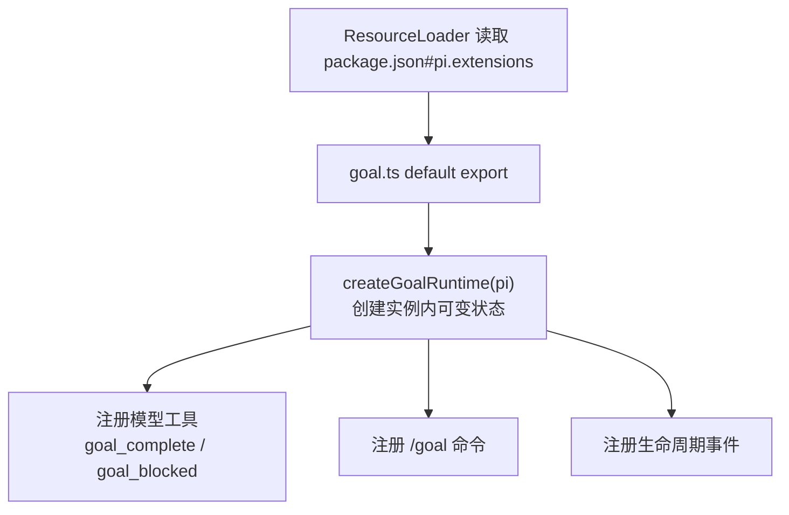
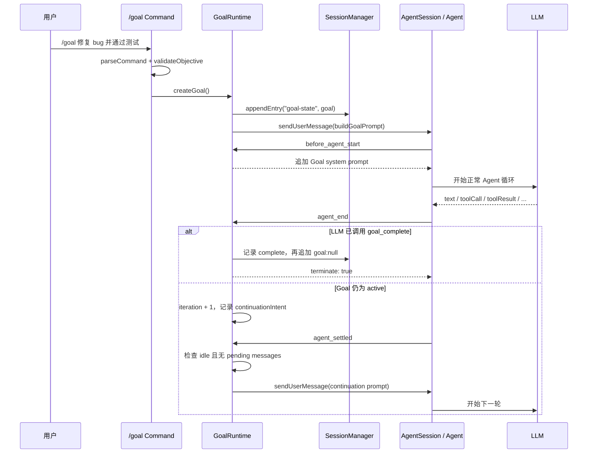
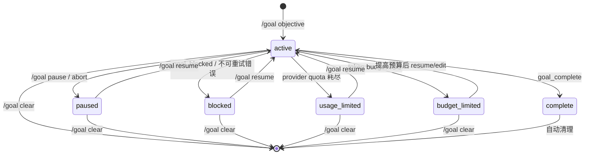
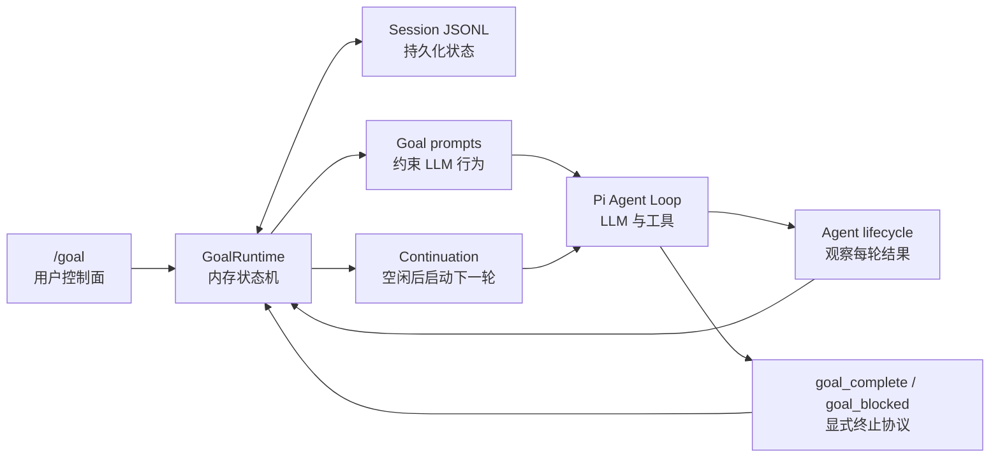

# pi-goal 快速 Onboarding

> 适合读者：已经了解 Pi 的 `AgentSession`、Agent 事件和扩展 API，希望快速理解 `pi-goal` 并用于面试表达。

**20 分钟速读路线**：先看第 1、5、6、8、11 和 15 节，就能讲清主流程、状态机、Session 持久化和并发保护；Token 预算、压缩和错误恢复可以第二遍再看。

## 1. 先用一句话理解它

`pi-goal` 是一个基于 Pi 扩展事件的「目标持续执行控制器」：它把用户的 `/goal` 保存在当前 Session 中，每次 Agent 未完成目标就在空闲后自动发起下一轮，直到模型调用 `goal_complete` 或 `goal_blocked` 明确结束。

```text
普通 Pi：用户发一次问题 -> Agent 运行 -> 本轮结束

pi-goal：用户设置 Goal -> Agent 运行
                           -> 未完成 -> 自动续跑 -> Agent 再运行
                           -> 完成/真阻塞 -> 终止 Goal
```

它没有修改 `runAgentLoop()`，也没有实现另一套 Agent。它只通过 Pi 公开的命令、工具、Session Entry 和生命周期事件，在原 Agent 循环外组织多次运行。

## 2. 五个文件怎么分工

```text
packages/pi-goal/
├── package.json
├── src/
│   ├── goal.ts          # 唯一 Pi 入口；命令、工具和事件状态机
│   ├── command.ts       # /goal 命令解析和补全
│   ├── persistence.ts   # Goal 数据结构与 Session 恢复
│   ├── accounting.ts    # Token 与 active elapsed time 统计
│   └── prompts.ts       # 启动、续跑、恢复和 system prompt
└── test/
    ├── goal.test.ts
    └── goal-runtime-smoke.mjs
```

`package.json#pi.extensions` 只声明了 `./src/goal.ts`，因此 ResourceLoader 只把它当作扩展入口，其他文件都是内部模块。

> 注意：这个项目「文件少」，但当前 `goal.ts` 已经超过 1300 行。快速学习时应先跟主链，不要一开始陷入预算和异常恢复分支。

## 3. 怎么运行

在 `pi-1` 仓库根目录可以用本地路径加载：

```bash
pi -e ./packages/pi-goal
```

常用命令：

```text
/goal
/goal 修复登录失败问题并运行测试
/goal --tokens 100k 完成重构并验证
/goal edit 修改后的目标
/goal pause
/goal resume
/goal clear
```

包自身声明的检查命令：

```bash
npm --prefix packages/pi-goal run typecheck
npm --prefix packages/pi-goal run test:runtime
```

### 当前 monorepo 的运行注意事项

上述命令是 `packages/pi-goal/package.json` 提供的脚本，但在当前 `pi-1` workspace 里不能直接作为干净验证：

- `@earendil-works/pi-ai` 和 `@earendil-works/pi-coding-agent` 被 npm workspace 链接到本仓库源码，`pi-goal/tsconfig.json#rootDir` 会导致独立 `typecheck` 报 workspace 文件不在 `rootDir` 中。
- runtime smoke 通过包的 `dist` 入口导入 Pi，需先在仓库根目录执行 `npm run build` 生成上游包产物。
- 当前根 `package.json` 要求 Node.js `>=22.19.0`。

这些是本地 monorepo 的构建/链接前置条件，不是 Goal 运行逻辑本身的失败。

## 4. 扩展加载时做了什么

默认导出函数是入口：

```ts
export default function goal(pi: ExtensionAPI) {
  registerGoalRuntime(pi);
}
```

`registerGoalRuntime()` 主要做四件事：

1. 创建当前扩展实例专属的 `GoalRuntime`。
2. 注册 `goal_complete` 和 `goal_blocked` 两个模型工具。
3. 注册一个顶层命令 `/goal`。
4. 订阅 Session、Agent、工具和上下文事件。



`GoalRuntime` 保存的不只是 `activeGoal`，还有续跑 intent/delivery、错误恢复、预算收尾和过期工具阻断标记。这些状态放在 factory 实例内，使同一 Node.js 进程中的多个 `AgentSession` 不会相互覆盖 Goal。

## 5. 必须先看懂的 Happy Path

以用户输入：

```text
/goal 修复登录 bug 并通过测试
```

为例，完整主链是：



### 5.1 `/goal` 命令阶段

`command.ts#parseCommand()` 把文本解析为：

```ts
type CommandResult = {
  kind: "start" | "pause" | "resume" | "clear" | "show" | "edit";
  objective?: string;
  tokenBudget?: number;
};
```

`startGoal()` 验证目标后：

1. 如果已有未完成 Goal，询问是否替换。
2. `createGoal()` 创建 `active` Goal，并生成新 UUID。
3. 记录当前 Session 已消耗 Token 作为 `baselineTokens`。
4. `appendEntry("goal-state", { goal })` 存入 Session JSONL。
5. `sendUserMessage(buildGoalPrompt(goal))` 把 Goal 作为一条新用户消息交给 Agent。

### 5.2 Agent 运行阶段

Agent 仍使用 Pi 原本的 LLM 与工具循环。扩展只在 `before_agent_start` 中向 system prompt 追加：

- 当前完整 Goal。
- 当前 `goal_id`。
- 不能以「完成一部分」缩小成功标准。
- 必须使用当前代码、命令、测试等权威证据验证。
- 真正完成时必须调用 `goal_complete`。

因此 Goal 规则不只出现在启动消息里，而是每次 Agent Run 都进入 system prompt。

### 5.3 本轮未完成：两阶段自动续跑

`agent_end` 不会立即发送 continuation，只会：

1. 读取本轮最后一条 AssistantMessage。
2. 更新 Token、active time 和 `iteration`。
3. 处理 aborted/error/budget 等分支。
4. 如果仍为 `active`，创建唯一 `continuationIntent`。

`agent_settled` 才调用 `dispatchContinuationIfSettled()`，它要求：

```text
Goal 还是同一个 id
AND status === active
AND ctx.isIdle() === true
AND 没有 pending steering/follow-up 消息
```

全部满足后，才通过 `pi.sendUserMessage()` 发送 continuation prompt。

这里拆成两阶段的原因是：`agent_end` 只表示 Agent Loop 不再产生新事件，之后仍可能有重试、压缩、监听器或排队消息。`agent_settled` 才是更稳妥的续跑边界。

### 5.4 完成阶段

LLM 调用：

```ts
goal_complete({
  goal_id: "当前 Goal UUID",
  summary: "完成了什么，用什么证据验证"
});
```

扩展会检查：

- 当前必须有 Goal。
- `goal_id` 必须和当前 Goal 一致。
- Goal 必须处于允许完成的状态。
- `summary` 不能为空，也不能明确包含「测试仍失败」等自相矛盾内容。

通过后状态转为 `complete`，取消 continuation，清空当前 Goal，并返回 `terminate: true`请求 Agent 结束当前工具批次/后续循环。

## 6. Goal 状态机



| 状态 | 意义 | 是否自动续跑 |
| --- | --- | --- |
| `active` | 正在持续完成 Goal | 是 |
| `paused` | 用户暂停或当前轮被 abort | 否 |
| `blocked` | 确实阻塞或不可重试错误 | 否 |
| `usage_limited` | Provider/账户额度限制 | 否 |
| `budget_limited` | 用户设定的 Goal Token 预算耗尽 | 否 |
| `complete` | 已显式完成 | 否，随后清理 |

`transitionGoal()` 是状态转换的共用入口，还会同时 checkpoint active time。当预算已经耗尽时，请求转回 `active` 也会被强制保持为 `budget_limited`。

## 7. 哪些事件最重要

| Pi 事件 | pi-goal 的作用 |
| --- | --- |
| `session_start` | 从当前 Session 恢复最后一个未完成 Goal |
| `session_shutdown` | checkpoint 时间和 Token，持久化状态 |
| `before_agent_start` | 把 Goal 与完成规则追加到 system prompt |
| `agent_end` | 结算本轮，分类结束原因，登记 continuation intent |
| `agent_settled` | Agent 空闲后真正发送 continuation |
| `tool_execution_end` | Assistant usage 已持久化后统计 Token，检查预算 |
| `tool_call` | 预算收尾时阻止新实质工具，也阻止过期 Goal 调用 |
| `input` | 识别新用户工作，清理过期续跑/工具阻断状态 |
| `context` | 过滤已失效的预算收尾消息 |
| `session_before_compact` | 压缩前持久化 Goal，取消过期续跑 |
| `session_compact` | 压缩后恢复 Goal，必要时重新登记续跑 |

面试最少要能讲清四个：`session_start -> before_agent_start -> agent_end -> agent_settled`。

## 8. Session 持久化：不是全局文件记忆

当前 Goal 以 Pi custom entry 存入 Session JSONL：

```ts
pi.appendEntry("goal-state", { goal });
```

概念上的 Session 内容：

```json
{"type":"custom","customType":"goal-state","data":{"goal":{"id":"...","text":"...","status":"active"}}}
```

`loadGoalFromSession()` 会在当前 branch 上：

1. 筛选 `type === "custom" && customType === "goal-state"`。
2. 取最后一条，即使用 append-only 日志表达最新状态。
3. 校验结构并归一化数值。
4. `complete` 或 `{ goal: null }` 不会被恢复成 active Goal。

所以它具有以下特性：

- `/reload` 或重新打开同一 Session 可恢复 Goal。
- 新 Session 即使 cwd 相同，也不继承旧 Goal。
- Session fork/branch 的 Goal 状态跟随当前分支。
- 恢复 active Goal 时重新开始 active clock，不把离线时间算入执行时间。

`~/.pi/agent/pi-goal-state.json` 是旧版按 cwd 存储的全局文件。当前实现不再从它加载，只在 clear 时清理历史数据。

## 9. 两个模型工具

### `goal_complete`

它不是执行业务的工具，而是让 LLM 向状态机提交「完成决策」。

`goal_id` 是过期轮次防护：当 Goal 被 edit 或 resume 时，`nextGoalInstance()` 生成新 UUID。旧 LLM 轮次即使延迟返回 `goal_complete`，也因 id 不匹配而无法结束新 Goal。

### `goal_blocked`

只允许真正 impasse，参数必须包含：

- 当前 `goal_id`。
- 需要用户或外部执行的 `reason`。
- 多次尝试的具体 `evidence`。
- 同一阻塞至少连续出现 3 轮的 `repeated_turns`。

通过后转为 `blocked`、取消续跑并返回 `terminate: true`。

## 10. Token 预算怎么算

Goal 开始时保存：

```text
baselineTokens = 当前 Session branch 中历史 Assistant Token 总量
```

运行中：

```text
tokensUsed = max(0, 当前 Assistant Token 总量 - baselineTokens)
```

单条 AssistantMessage 优先使用 `usage.totalTokens`，缺失时回退为：

```text
input + output + cacheRead + cacheWrite
```

预算只能在一次 Assistant 调用已经完成并持久化 usage 后被精确发现，因此可能超出一次模型调用。达到预算后：

1. Goal 转为 `budget_limited`。
2. 取消自动续跑。
3. 如果处于工具链边界，最多插入一次收尾消息。
4. 收尾阶段只允许总结和在已有证据充分时调用 `goal_complete`，其他实质工具被阻止。

## 11. 三个容易被忽略的并发/时序保护

### 11.1 Intent 和 Delivery 分离

- `continuationIntent`：已决定要续跑，但还没发送。
- `continuationDelivery`：已把消息交给 Pi，但还没观察到这次 Run 真正开始。

这两个状态使暂停、替换 Goal 或新用户输入可以取消已排队但尚未启动的自动续跑。

### 11.2 Continuation marker

每条自动续跑 prompt 都带隐藏 marker：

```html
<!-- pi-goal-continuation:goalId:iteration:uuid -->
```

`input` 和 `before_agent_start` 可用 marker 区分「自己的续跑」与「用户/其他扩展的新工作」，从而防止过期 prompt 抢跑。

### 11.3 Goal ID 旋转

`edit` 和 `resume` 会保留用量等 Goal 信息，但生成新 id。这是一种 optimistic stale-result guard，与数据库中的 version token 思路相似。

## 12. 异常和压缩逻辑：第二遍再看

`agent_end` 会根据最后 AssistantMessage 分类：

```text
aborted
  -> paused

usage/quota error
  -> usage_limited

不可重试的其他错误
  -> blocked

429/5xx/network/timeout/context overflow 等可重试错误
  -> 保持 active，把重试交给 Pi，不额外生成 continuation
```

压缩前会 checkpoint Goal 并取消旧 continuation；压缩后重新从 Session 加载 Goal。如果是 Pi 因 context overflow 自己发起的 retry，扩展不再发一次自动 continuation，避免重复 Run。

## 13. 建议的源码阅读顺序

### 第一遍：30 分钟掌握主链

1. `package.json#pi.extensions`。
2. `persistence.ts#ActiveGoal`。
3. `goal.ts` 中 `registerGoalRuntime()` 的注册部分。
4. `startGoal()`。
5. `before_agent_start -> agent_end -> agent_settled`。
6. `requestContinuation()` 和 `dispatchContinuationIfSettled()`。
7. `goal_complete.execute()`。

### 第二遍：掌握状态与保护

1. `pauseGoal / resumeGoal / editGoal / clearGoal`。
2. `transitionGoal / nextGoalInstance`。
3. `persistGoal / loadGoalFromSession`。
4. continuation marker 与 stale tool-call guard。
5. `goal_blocked.execute()`。

### 第三遍：再看生产级边界

1. Token budget wrap-up。
2. provider error 分类和 recovery。
3. manual/threshold/overflow compaction。
4. 多 Session 实例隔离与 race test。

## 14. 测试怎么看

`goal.test.ts` 是细粒度单元测试，覆盖：

- 命令解析和数值统计。
- Goal 状态转换。
- stale goal id 和 continuation race。
- 预算边界。
- 错误分类与压缩恢复。
- 多 AgentSession 隔离。

`goal-runtime-smoke.mjs` 则真正组装 `ResourceLoader -> SessionManager -> createAgentSession()`，用 faux provider 验证扩展在 Pi runtime 中的事件时序。它比纯 mock 更能证明集成正确。

快速学习时，先看 runtime smoke 的三个场景：

1. `normalContinuationScenario()`：本轮停止后自动续跑并完成。
2. `queuedInputScenario()`：用户排队消息优先于自动 continuation。
3. `pauseScenario()`：暂停会 abort 当前轮且不会再续跑。

## 15. 面试时怎么讲

### 30 秒版

> 我基于 Pi 的扩展机制实现了一个持续 Goal 运行控制器。它不侵入 Agent Loop，而是通过 `agent_end` 登记续跑意图、`agent_settled` 在空闲时安全发起下一轮，并用 Session custom entry 实现会话级持久化。同时通过 Goal UUID 旋转和 continuation marker 防止异步过期结果完成新目标。

### 技术亮点

- **低侵入集成**：使用 Extension API 组合 Agent Run，无需 fork 或修改 Agent 核心循环。
- **事件驱动续跑**：把「本轮结束」与「真正空闲」分开，让 retry、compaction 和用户排队消息优先处理。
- **append-only 持久化**：Goal 作为 Session JSONL custom entry 跟随会话分支，支持 reload 和 resume。
- **异步过期保护**：用 Goal UUID 作为 version token，用 continuation marker 识别自动消息。
- **可控自主性**：提供 pause/resume/clear、Token 预算、明确完成和严格阻塞出口。

### 面试官可能追问

**Q：这不就是发一条「继续」吗？**

A：核心动作是发送续跑 prompt，但难点在正确的时序和状态管理：不能抢在 retry、compaction 或用户排队消息前启动，不能重复发送，Goal 已暂停/替换后不能再续跑，旧轮次也不能完成新 Goal。

**Q：为什么不在 `agent_end` 直接续跑？**

A：`agent_end` 不等于整个 Session 已经 idle，还可能有 awaited listener、自动压缩、retry 或 pending messages。所以 `agent_end` 只登记 intent，`agent_settled` 再根据 idle/pending gate 发送。

**Q：为什么不存在全局 JSON 文件？**

A：Goal 应属于会话而非 cwd。写入 Session JSONL 可自然获得会话隔离、分支语义和恢复能力，避免同目录不同 Session 相互污染。

**Q：`goal_complete` 能保证任务真的完成吗？**

A：不能数学上保证。prompt 强调证据审计，工具强制当前 Goal ID 并拒绝空或明显矛盾的总结，但外部工作是否真正完成仍取决于模型收集的权威证据。

**Q：为什么要在 edit/resume 时更换 Goal ID？**

A：Agent 工具调用是异步的。更换 ID 等价于更换 version token，能拒绝修改前或暂停前的延迟 `goal_complete/goal_blocked`。

## 16. 二次学习开发怎么改最合适

为了快速完成一个能在面试中讲清的自己版本，可以先实现精简版：

```text
保留：
- active / paused / blocked / complete
- /goal start|pause|resume|clear
- goal_complete / goal_blocked
- Session custom entry 持久化
- agent_end + agent_settled 两阶段续跑
- goal_id 过期保护

第一版暂不做：
- Token budget wrap-up
- provider error 正则分类
- compaction recovery
- cancelled marker 上限管理
- 复杂 stale tool-call block
```

这样仍然能完整体现：事件驱动、状态机、Agent 工具协议、Session 持久化和异步时序保护。后续再用预算、压缩恢复和 runtime smoke 测试作为进阶亮点。

## 17. 最后的心智模型



记住一句话即可：

> `pi-goal` 用 Session 保存 Goal，用 system prompt 约束执行，用 Agent 事件决定何时续跑，用模型工具显式结束，再用 ID 和 marker 保护异步时序。
