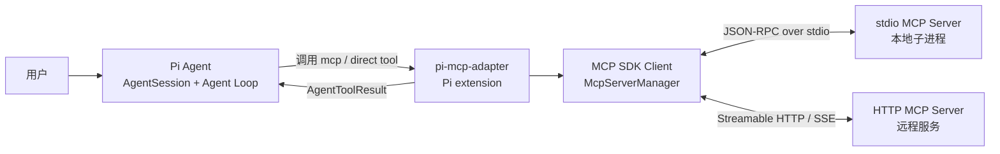
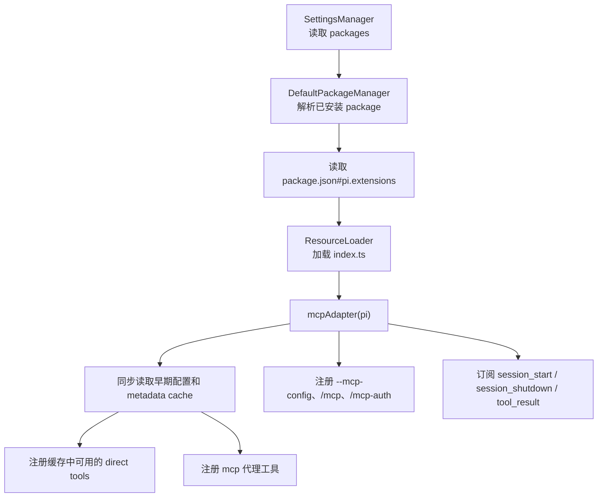
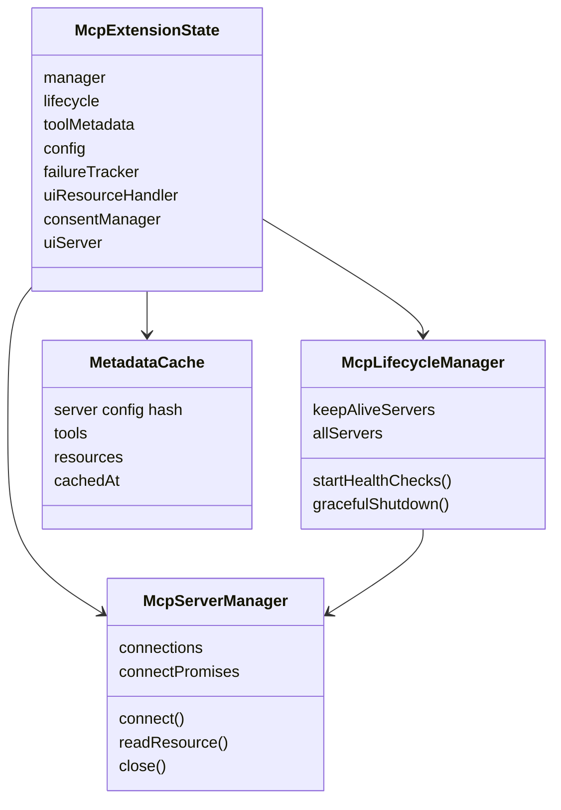
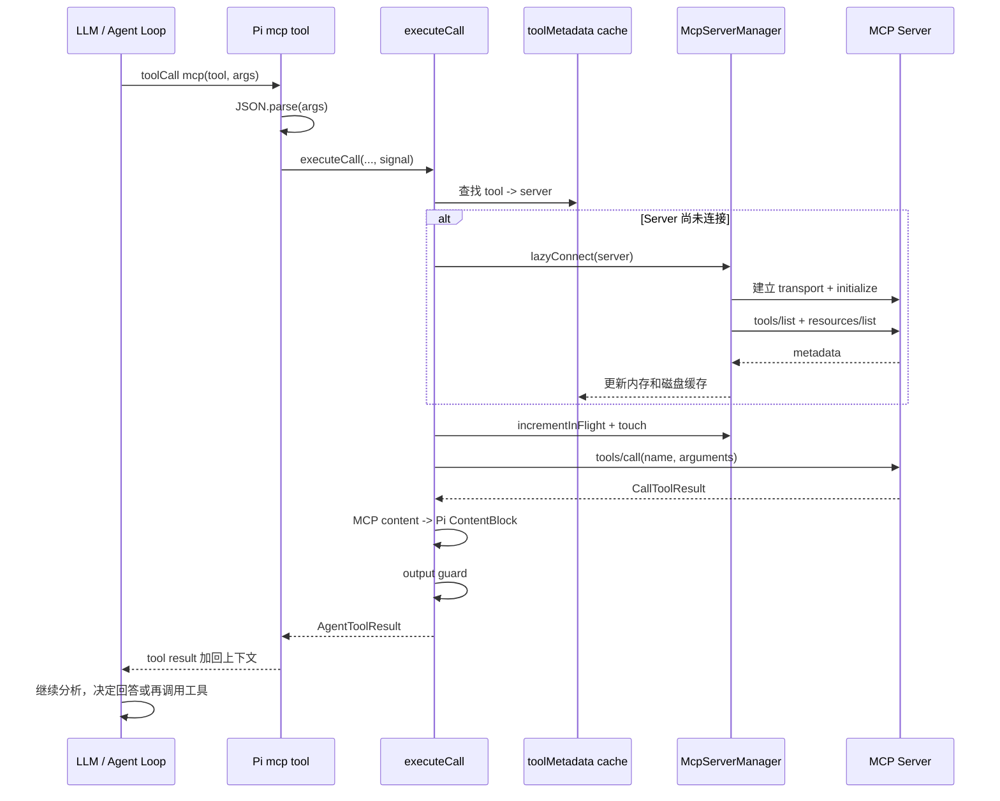
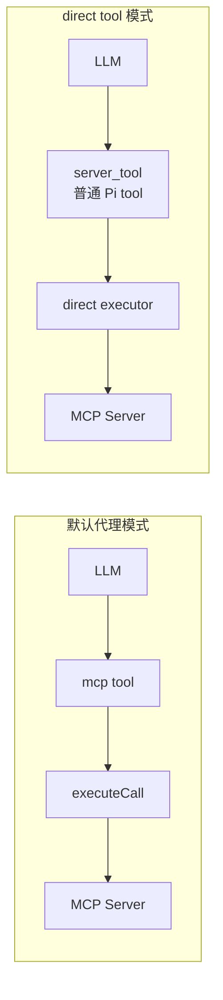
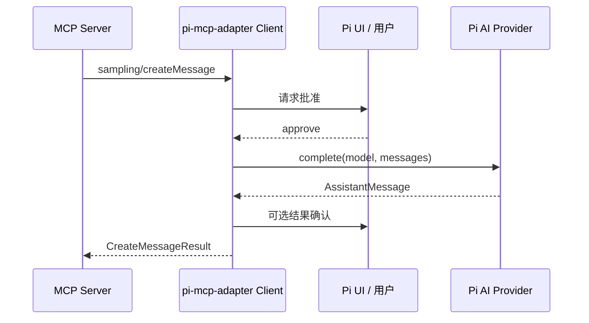
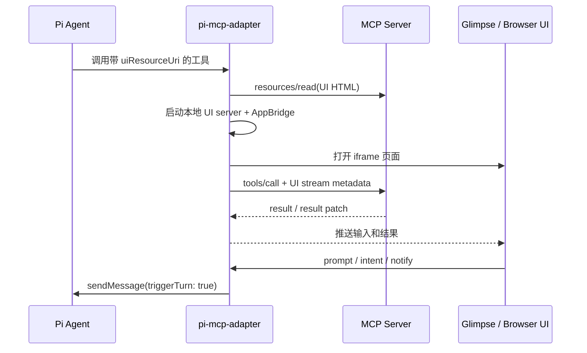
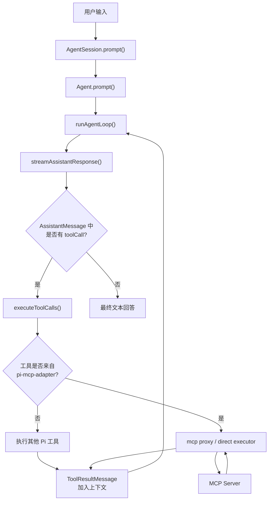
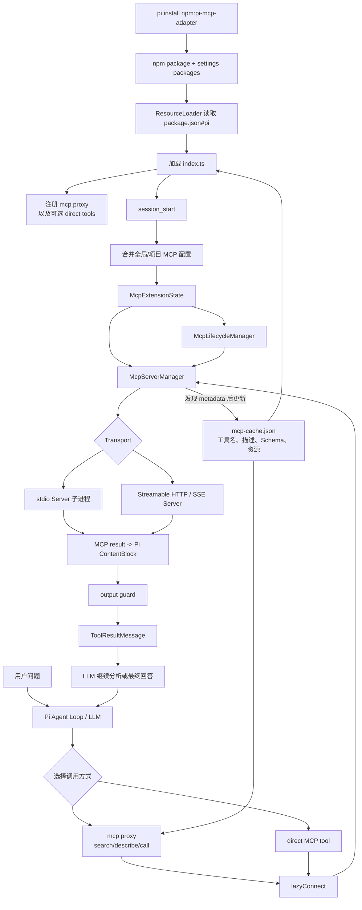

# pi-mcp-adapter 源码 Onboarding

> 适合读者：已经理解 Pi 的 `Agent`、`AgentSession`、Agent Loop 和扩展机制，希望继续理解 Pi 如何接入 MCP。

## 1. 先用一句话理解它

`pi-mcp-adapter` 是运行在 Pi 进程内的 **MCP Client 扩展**。它读取 MCP Server 配置，建立 stdio 或 HTTP 连接，把 MCP Server 暴露的 tools、resources 和 UI 能力转换成 Pi Agent 可以使用的工具。

它不是 MCP Server，也不是另一个 Agent：

```text
Pi Agent
  -> 调用 Pi 工具 mcp（或 direct tool）
  -> pi-mcp-adapter 作为 MCP Client
  -> 连接一个 MCP Server
  -> tools/call 或 resources/read
  -> MCP 结果转换成 Pi AgentToolResult
  -> 结果回到 Agent Loop，LLM 继续分析
```

它最核心的设计目标是：**给 Agent 很多 MCP 能力，但不要把几百个 MCP 工具 Schema 一次性塞进模型上下文。**

默认情况下，它只向 Pi 注册一个约 200 token 的 `mcp` 网关工具。模型先搜索/描述工具，再通过网关调用。MCP Server 默认也不会在 Pi 启动时全部连接，而是在第一次使用时延迟连接。

## 2. 先分清三个角色

| 名称 | 在本项目中的实例 | 作用 |
| --- | --- | --- |
| Pi package | npm 包 `pi-mcp-adapter` | 可被 `pi install` 安装的扩展包 |
| Pi extension | `index.ts` 默认导出函数 | 向 Pi 注册工具、命令和生命周期监听器 |
| MCP Client | `McpServerManager` 内创建的 SDK `Client` | 连接 MCP Server、列工具、调用工具、读资源 |
| MCP Server | 配置中的 `command` 或 `url` | 真正提供工具、资源、UI、sampling/elicitation 请求 |

总体关系：



## 3. `pi install npm:pi-mcp-adapter` 做了什么

这条命令走的是 Pi 自己的 package manager，不是 `pi-mcp-adapter/cli.js`。

调用链可以概括为：

```text
pi install npm:pi-mcp-adapter
  -> package-manager-cli.ts 识别 install 命令
  -> DefaultPackageManager.installAndPersist()
  -> install()
  -> parseSource("npm:pi-mcp-adapter")
  -> installNpm()
  -> npm install pi-mcp-adapter --prefix <Pi 管理目录>
  -> addSourceToSettings()
  -> settings.json 的 packages 增加 npm:pi-mcp-adapter
```

默认是用户级安装：

- 包安装到 Pi 管理的用户 npm root，通常位于 `~/.pi/agent/npm/`。
- source 写入 `~/.pi/agent/settings.json` 的 `packages`。

使用 `-l` 时是项目级安装：

```bash
pi install -l npm:pi-mcp-adapter
```

- 包安装到项目的 `.pi/npm/`。
- source 写入项目 `.pi/settings.json`。
- 项目必须被信任。

包的 `package.json` 中有：

```json
{
  "pi": {
    "extensions": ["./index.ts"]
  }
}
```

Pi 的 package manager 读取 `package.json#pi` 后，将 `index.ts` 作为扩展入口交给 `ResourceLoader`。这个包没有通过清单额外声明 skill 或 prompt template。

### 安装不会自动创建 MCP 配置

安装完成只意味着“Pi 可以加载这个扩展”，并不意味着已经配置了 MCP Server。

配置 MCP Server 是另一条流程：

- 在 `.mcp.json` / `mcp.json` 中手写配置。
- Pi 启动后运行 `/mcp setup`。
- 运行独立 helper：`pi-mcp-adapter init`。

`package.json#bin` 中的：

```json
{
  "bin": {
    "pi-mcp-adapter": "cli.js"
  }
}
```

只用于提供 `pi-mcp-adapter init`。它会发现 Cursor、Claude、Codex、Windsurf、VS Code 等已有配置，并把需要的 `imports` 写入 Pi 全局 `mcp.json`。它不负责 npm 包安装；旧的 `pi-mcp-adapter install` 已明确提示改用 `pi install`。

## 4. Pi 下次启动时如何加载它



入口是 `packages/pi-mcp-adapter/index.ts`：

```ts
export default function mcpAdapter(pi: ExtensionAPI) {
  // 注册工具、命令和事件监听器
}
```

这里有两个不同时间点，不能混在一起：

### 时间点 A：扩展模块加载

`mcpAdapter(pi)` 立即执行：

1. 读取早期配置 `earlyConfig`。
2. 读取 metadata cache `earlyCache`。
3. 根据缓存解析 direct tools。
4. 同步调用 `pi.registerTool()` 注册工具定义。
5. 注册命令、flag 和生命周期监听器。

此时通常还没有连接 MCP Server。

### 时间点 B：Pi 发出 `session_start`

监听器开始建立当前会话专属的运行状态：

```ts
pi.on("session_start", async (_event, ctx) => {
  await shutdownState(previousState, "session_restart");
  await initializeOAuth();
  initPromise = initializeMcp(pi, ctx);
});
```

`initializeMcp()` 会加载当前 `cwd` 的完整配置，创建 ServerManager、LifecycleManager、UI handler、consent manager，并按生命周期策略决定连接哪些 Server。

之所以先注册工具、后初始化连接，是因为 Pi 需要在建立 Agent 工具集和系统提示词时知道工具名称及 Schema，而网络连接和子进程启动可以继续延迟。

## 5. 配置如何发现和合并

`config.ts#loadMcpConfig()` 按以下顺序读取，越靠后的配置优先级越高：

1. `~/.config/mcp/mcp.json`：通用的用户级 MCP 配置。
2. `~/.pi/agent/mcp.json`：Pi 用户级覆盖。
3. `<cwd>/.mcp.json`：项目共享配置。
4. `<cwd>/.pi/mcp.json`：项目的 Pi 专用覆盖。

如果传入 `--mcp-config <path>`，这个路径代替第 2 项 Pi 全局配置路径。

合并不是简单地用整个 Server 覆盖：

```ts
merged[name] = { ...(merged[name] ?? {}), ...definition };
```

因此同名 Server 会按字段浅合并。例如全局配置提供 `command/args`，项目配置只覆盖 `env` 或 `lifecycle`。

`imports` 还可以显式导入宿主特有格式：

```json
{
  "imports": ["cursor", "claude-code", "codex"],
  "mcpServers": {}
}
```

## 6. 配置一个 MCP Server

### stdio Server

```json
{
  "mcpServers": {
    "filesystem": {
      "command": "npx",
      "args": ["-y", "@modelcontextprotocol/server-filesystem", "/work"],
      "lifecycle": "lazy"
    }
  }
}
```

适配器使用 `StdioClientTransport` 启动本地子进程，并通过 stdin/stdout 交换 MCP JSON-RPC 消息。

对于 `npx` / `npm` 命令，`npx-resolver.ts` 会尽量解析到真正的 JS 入口或二进制，直接用 `node`/binary 启动，减少额外 npm 父进程占用。

### 远程 Server

```json
{
  "mcpServers": {
    "remote": {
      "url": "https://example.com/mcp",
      "auth": "oauth"
    }
  }
}
```

HTTP 连接会先探测现代的 `StreamableHTTPClientTransport`，成功后重新创建一条正式连接；若服务不支持且错误不是取消或未授权，再回退到旧的 `SSEClientTransport`。

## 7. 初始化后各对象的关系

`initializeMcp()` 返回一个 `McpExtensionState`：



各对象职责：

| 模块 | 职责 |
| --- | --- |
| `index.ts` | Pi 扩展入口，注册工具/命令/事件，分发代理工具模式 |
| `init.ts` | 组装整个运行状态，启动初始连接，更新 metadata/status |
| `server-manager.ts` | MCP SDK Client、transport、连接去重、工具/资源发现、关闭 |
| `lifecycle.ts` | idle 回收、keep-alive 检查和自动重连 |
| `metadata-cache.ts` | 持久化工具/资源元数据，校验配置 hash 和有效期 |
| `proxy-modes.ts` | `mcp` 网关的 status/list/search/describe/connect/call/auth |
| `direct-tools.ts` | 将指定 MCP 工具注册成一等 Pi 工具并执行 |
| `tool-registrar.ts` | MCP content 转成 Pi `ContentBlock` |
| `mcp-output-guard.ts` | 限制过大工具输出进入模型上下文 |

## 8. 为什么默认只有一个 `mcp` 工具

假设配置了 20 个 MCP Server，每个有 20 个工具。如果把 400 个工具的名称、描述和完整 JSON Schema 都注册给模型，工具定义本身就会占用大量上下文，并使模型选错工具的概率上升。

默认设计改成分阶段发现：

```text
mcp({})
  -> 看 Server 状态

mcp({ search: "github issue" })
  -> 只返回相关工具

mcp({ describe: "github_create_issue" })
  -> 获取一个工具的参数 Schema

mcp({ tool: "github_create_issue", args: "{...}" })
  -> 真正调用
```

代理工具参数的分发优先级写死在 `index.ts`：

```text
action
  > tool
  > connect
  > describe
  > search
  > server
  > status
```

所以一次调用即使意外传了多个模式字段，也只会进入最高优先级的分支。

`args` 被设计为 JSON 字符串：

```ts
mcp({
  tool: "server_tool",
  args: '{"path":"README.md"}'
})
```

扩展先 `JSON.parse()`，并检查结果必须是普通 object，不能是数组、`null` 或原始值。实际参数合法性主要由 MCP Server 按工具 Schema 校验。

## 9. 一次代理工具调用的完整过程



`executeCall()` 的主要步骤是：

1. 根据显示名称、server override 或前缀找到 `ToolMetadata`。
2. 若缓存缺失，尝试连接对应 Server 并刷新 metadata。
3. 处理 `needs-auth`，可选执行 `autoAuth` 后重试一次。
4. 检查最近 60 秒连接失败退避，避免每个模型回合反复启动失败 Server。
5. 若是 resource 虚拟工具，执行 `resources/read`。
6. 否则执行 `client.callTool()`。
7. 把 `CallToolResult.content` 转成 Pi content。
8. 对超大输出执行 output guard。
9. 在 `finally` 中减少 `inFlight` 并更新时间，供 idle 回收判断。

工具结果回到 Pi 后，原来的 Agent Loop 会把它作为 `ToolResultMessage` 放入上下文，再调用 LLM。也就是说，MCP adapter 并没有自己的 ReAct Loop；它只是 Pi Agent Loop 中的一组工具实现。

## 10. metadata cache 为什么重要

缓存默认位于：

```text
~/.pi/agent/mcp-cache.json
```

如果设置了 `PI_CODING_AGENT_DIR`，则位于对应 agent dir。

每个 Server 缓存：

```ts
{
  configHash,
  tools: [{ name, description, inputSchema, uiResourceUri }],
  resources: [{ uri, name, description }],
  cachedAt
}
```

缓存有效条件：

- cache version 正确。
- Server 配置 hash 一致。
- 默认没有超过 7 天。

hash 只包含会影响 Server 身份和工具结果的配置，例如 command、args、env、cwd、url、headers、auth、资源和排除规则；`lifecycle`、idle timeout、debug 等运行策略不会让 metadata 失效。

缓存带来三个效果：

1. Server 未连接时，`search/list/describe` 仍然可用。
2. Pi 启动时不必连接所有 lazy Server。
3. direct tools 可以在扩展加载阶段拿到名称、描述和 Schema。

第一次完全没有缓存文件时，`initializeMcp()` 会 bootstrap 所有 Server 一次，获取 metadata 并写入缓存。以后启动时，lazy Server 可直接从缓存重建 metadata。

保存缓存采用临时文件加 `renameSync()`，并在写入前合并已有 Server 条目，降低部分写入和不同 Server 更新互相覆盖的风险。

## 11. Server 生命周期策略

每个 Server 可配置：

| 模式 | 启动时 | 空闲后 | 断开后 |
| --- | --- | --- | --- |
| `lazy` | 默认不连接 | 默认 10 分钟关闭 | 下次调用重连 |
| `eager` | 启动时连接 | 默认不因 idle 关闭 | 使用时可再连接 |
| `keep-alive` | 启动时连接 | 不做 idle 关闭 | 健康检查自动重连 |

`McpLifecycleManager` 默认每 30 秒检查：

- keep-alive Server 是否断开，断开则重连并刷新 metadata。
- 普通 Server 是否超过 idle timeout。
- `inFlight > 0` 的 Server 不会被当成 idle 关闭。

`McpServerManager.connect()` 还有连接去重：同一 Server 的并发连接请求共享 `connectPromises` 中的同一个 Promise，避免启动两个相同子进程。

`session_shutdown` 时扩展会：

1. 关闭 MCP UI。
2. 把仍连接 Server 的 metadata flush 到缓存。
3. 停止健康检查。
4. 关闭所有 SDK Client 和 transport。
5. 关闭 OAuth 辅助状态。

因此当前实现是 **每个 Pi Session 自己持有 MCP Server 连接**，还没有跨 Session 共享 Server 进程。

## 12. direct tools 是什么

代理模式节省上下文，但模型必须先 search/describe/call。对高频或关键工具，可以配置为 direct tool：

```json
{
  "settings": {
    "directTools": true
  },
  "mcpServers": {
    "github": {
      "url": "https://example.com/mcp",
      "directTools": ["create_issue", "search_code"]
    }
  }
}
```

全局 `settings.directTools: true` 表示将各 Server 的工具全部提升；Server 自己的 `directTools` 可以是 `true`，也可以是工具名数组，并优先于全局设置。

也可以按 Server 配置，或使用环境变量：

```bash
MCP_DIRECT_TOOLS=github/create_issue,filesystem pi
```

direct tool 会被注册为普通 Pi 工具，模型可以直接产生对应 `toolCall`，不需要套一层 `mcp({ tool, args })`。



关键问题是：Pi 注册工具发生在 Server 连接之前，Schema 从哪里来？答案是 metadata cache。

```text
扩展加载
  -> loadMetadataCache()
  -> resolveDirectTools()
  -> 用缓存 Schema 执行 pi.registerTool()

工具真正被调用
  -> createDirectToolExecutor()
  -> 等待 initializeMcp()
  -> lazyConnect()
  -> callTool()
```

如果配置要求 direct tools，但对应 Server 没有有效缓存，初始化阶段会连接它并建立缓存，然后提示重启；下次 Pi 启动才能把这些工具注册进静态工具集。

`disableProxyTool: true` 只有在所需 direct tools 都能从缓存注册时才真正隐藏 `mcp` 网关。否则仍保留代理工具，防止扩展变得不可用。

direct tools 会避开 Pi 内置工具名冲突，例如 `read`、`bash`、`edit`、`write`、`grep`、`find`、`ls` 和 `mcp`，并跳过重复名称。

## 13. tools 和 resources 如何统一暴露

MCP tool 原生对应 `tools/call`。

MCP resource 没有参数化调用语义，因此扩展把它虚拟成工具：

```text
资源名称: Project Documentation
虚拟工具: get_project_documentation
调用结果: client.readResource({ uri })
```

是否暴露资源由 `exposeResources` 控制。resource 虚拟工具和普通 tool 一起进入 `ToolMetadata[]`，所以 search/list/describe 和 direct tool 解析可以采用同一套逻辑。

结果内容转换规则在 `tool-registrar.ts`：

| MCP content | Pi content |
| --- | --- |
| `text` | Pi text block |
| `image` | Pi 原生 image block |
| `resource` | 带 URI 的格式化 text |
| `resource_link` | 带名称和 URI 的 text |
| `audio` | 当前转成说明性 text |
| 其他 | JSON text |

当 `content` 为空但有 `structuredContent` 时，会把 structured content 格式化为 JSON 文本作为回退。

## 14. 大输出保护

MCP Server 可能返回日志、网页、数据库结果等超大内容。若完整加入上下文，会迅速消耗 token，甚至让下一次模型请求失败。

默认阈值：

- 文本最多 50 KiB。
- 文本最多 2000 行。
- `details.mcpResult` 最多 16 KiB。

超过后：

1. 返回内容前部预览。
2. 完整文本写入权限受限的临时文件。
3. 在结果中告诉 Agent 完整文件路径。
4. image block 不按文本截断，继续作为原生图片传递。
5. 过大的原始 MCP result 也会摘要并落临时文件。

可通过配置调整，或用 `MCP_OUTPUT_GUARD=0` 关闭。

这不是仅影响 TUI 展示的 renderer；它是在构造 `AgentToolResult` 时限制真正进入模型上下文的内容。

## 15. OAuth 与认证

远程 Server 支持：

- 静态 headers。
- bearer token。
- OAuth 2.1 authorization code。
- OAuth client credentials 等配置。

连接遇到 SDK `UnauthorizedError` 且 Server 支持 OAuth 时，Manager 不直接把它当普通连接失败，而是保存状态为 `needs-auth`。

认证入口包括：

```text
/mcp-auth <server>
/mcp 面板中的认证操作
mcp({ action: "auth-start", server: "name" })
mcp({ action: "auth-complete", server: "name", args: "{...}" })
```

后两种适用于 headless/remote 模式：Agent 获得 authorization URL，用户在本地浏览器完成流程，再把 redirect URL 或 code 传回来。

开启 `settings.autoAuth` 后，connect、proxy call 和 direct call 遇到 `needs-auth` 会自动尝试认证并重连一次。需要用户浏览器交互但当前没有 UI 时，不会假装能够自动完成。

## 16. MCP Server 反向请求 Pi：sampling

普通调用方向是 Pi -> MCP Server；MCP 协议也允许 Server 向 Client 请求一次模型生成，这叫 sampling。



实现位于 `sampling-handler.ts`。它会：

1. 把 MCP sampling messages 转成 Pi AI `Message[]`。
2. 根据偏好和当前模型解析可用 model、apiKey、headers。
3. 默认请求用户批准，或使用 `samplingAutoApprove`。
4. 调用 `@earendil-works/pi-ai` 的 `complete()`。
5. 把 AssistantMessage 转回 MCP `CreateMessageResult`。

当前 sampling 只支持文本；MCP sampling 中的 task、context inclusion、tools、tool choice、stop sequence、audio/image 等会明确拒绝。

注意：这次 `complete()` 是 MCP Server 发起的嵌套模型请求，不会自动启动一个新的 Pi Agent Loop。

## 17. MCP Server 反向请求用户：elicitation

Elicitation 是 MCP Server 在执行过程中请求用户补充信息或完成外部交互。

扩展支持两类：

- Form elicitation：字符串、数字、布尔、单选/多选等表单字段，通过 Pi UI 逐项收集并校验。
- URL elicitation：询问用户是否打开 URL 完成登录、支付或授权等浏览器流程。

URL 流程不会在用户接受后自动假定原工具已完成。适配器会提示：先完成浏览器交互，再重试原工具；收到 `elicitation/complete` notification 后，Pi UI 再提示可以重试。

Elicitation 只有在 Pi 有 UI 且配置未禁用时注册；URL 流程目前还要求 TUI 模式。

## 18. MCP Apps / UI 如何工作

一个 MCP tool 可以在 `_meta` 中声明 UI resource URI。此时工具调用不只返回文字，还可打开交互界面。



UI 打开策略：

- macOS 且安装 Glimpse 时，优先原生 WKWebView 窗口。
- 否则在浏览器打开本地页面。
- `MCP_UI_VIEWER=browser|glimpse` 可覆盖选择。

同一 Server、同一 tool 的 UI 已打开时，后续调用会复用窗口并推送新输入/结果；切换到不同工具时会替换原 session。

UI 发回 prompt 或 intent 时，`ui-session.ts` 调用：

```ts
pi.sendMessage(customMessage, { triggerTurn: true });
```

这会唤醒 Pi Agent 开始新一轮处理。已完成 UI session 的消息最多保留 10 组，Agent 可通过：

```ts
mcp({ action: "ui-messages" })
```

读取并清空。

UI 自己也可以反向调用 MCP tools。`ConsentManager` 默认采用 `once-per-server`，要求用户对每个 Server 首次授权，防止任意网页 UI 静默调用高权限工具。

## 19. 取消、错误和并发细节

### 取消

Pi 工具执行传入的 `AbortSignal` 会继续传给：

- lazy connect。
- MCP SDK request options。
- `tools/call` / `resources/read`。
- 本地 `abortable()` Promise 包装。

取消 HTTP 探测时不会错误地回退到 SSE，因为“用户取消”不是“Streamable HTTP 不受支持”的证据。

### MCP 工具错误

适配器经常把错误转换成结构化 `AgentToolResult`，而不是直接 throw。为了让 Pi 将真正的 MCP tool failure 记录成失败，`tool_result` hook 检查：

```text
details.error === "tool_error" 或 "call_failed"
  -> 返回 { isError: true }
```

认证提示、搜索无结果、未连接等状态不被误标成“工具执行失败”。

### 连接竞争

- `connectPromises` 去重并发连接。
- `close()` 先从 Map 删除连接，再异步关闭 Client/transport，避免旧 close 删除刚建立的新连接。
- 工具执行通过 `inFlight` 防止 idle checker 在请求中途关闭 Server。
- `lifecycleGeneration` 防止快速 session restart 时，旧的异步初始化结果覆盖新 session state。

这些细节说明该扩展不只是协议转换器，也承担了较完整的连接生命周期和竞态管理。

## 20. `/mcp` 命令和 `mcp` 工具不是一回事

| 入口 | 使用者 | 作用 |
| --- | --- | --- |
| `mcp` Pi tool | LLM | 搜索、描述、连接、调用 MCP tools |
| `/mcp` slash command | 人类用户 | 打开状态/配置面板，reconnect、setup、logout |
| `/mcp-auth` | 人类用户 | 选择 Server 并执行 OAuth |
| `pi-mcp-adapter init` | shell 用户 | 检测其他客户端配置并写入 imports |

`/mcp setup` 修改配置后会调用 `ctx.reload()`，让 Pi 重新加载扩展和工具集。这一点对 direct tools 尤其重要，因为其 Schema 需要在扩展加载阶段注册。

## 21. 它与 Pi Agent Loop 的关系

把它放回你前面学习的 Pi Agent 流程：



结论：

- ReAct 循环属于 Pi Agent 的 `runAgentLoop()`。
- `pi-mcp-adapter` 注册的是这个循环可以调用的工具。
- MCP Server 不直接控制 Agent Loop，只返回 tool result。
- LLM 看到结果后，才决定继续调用工具还是生成最终回答。
- sampling 和 UI `triggerTurn` 是协议扩展产生的额外入口，但仍通过 Pi 的模型/API或消息机制处理。

## 22. 安全边界

这个扩展本身不是 sandbox。

stdio MCP Server 的 `command` 会作为本地子进程运行，并继承当前环境变量，再叠加配置中的 `env`；它能做什么取决于操作系统权限和 Server 自身实现。远程 MCP Server 则能看到传给它的参数和读取请求。

需要注意：

- 只配置可信的 MCP Server。
- 不要把密钥直接提交到项目 `.mcp.json`，优先使用环境变量插值或 OAuth。
- 项目级 MCP 配置等同于“允许项目建议运行某个命令”，应结合 Pi 的项目信任机制审查。
- UI consent 只保护 UI 反向调用 tools，不是整个 MCP Server 的进程 sandbox。
- output guard 控制上下文大小，不是数据防泄漏机制。

## 23. 推荐源码阅读顺序

### 第一轮：建立主流程

1. `README.md`：先知道功能和配置表面。
2. `package.json`：确认 Pi 入口只有 `index.ts`。
3. `index.ts`：看工具、命令和生命周期注册。
4. `init.ts`：看 state 如何组装和初始连接策略。
5. `proxy-modes.ts#executeCall()`：看一次代理调用全过程。
6. `server-manager.ts`：看 SDK Client 和 transport。

### 第二轮：理解性能设计

1. `metadata-cache.ts`：metadata 如何缓存和失效。
2. `lifecycle.ts`：lazy/eager/keep-alive。
3. `direct-tools.ts`：缓存如何支持静态工具注册。
4. `mcp-output-guard.ts`：如何避免超大结果污染上下文。
5. `npx-resolver.ts`：如何减少 stdio Server 进程开销。

### 第三轮：理解 MCP 高级能力

1. `sampling-handler.ts`。
2. `elicitation-handler.ts`。
3. `mcp-auth-flow.ts`、`mcp-oauth-provider.ts`。
4. `ui-resource-handler.ts`、`ui-session.ts`、`ui-server.ts`。
5. `consent-manager.ts`。

## 24. 最后用一张总图记住



## 25. 一句话总结设计亮点

`pi-mcp-adapter` 的价值不只是“让 Pi 支持 MCP”，而是用 **单一代理工具 + 元数据缓存 + 延迟连接 + 可选 direct tools + 生命周期管理 + 输出限流**，在工具数量、上下文成本、启动速度和使用便利性之间做了一套完整的工程折中；同时又实现了 OAuth、sampling、elicitation 和 MCP Apps，使 Pi 能作为较完整的 MCP Client host。
