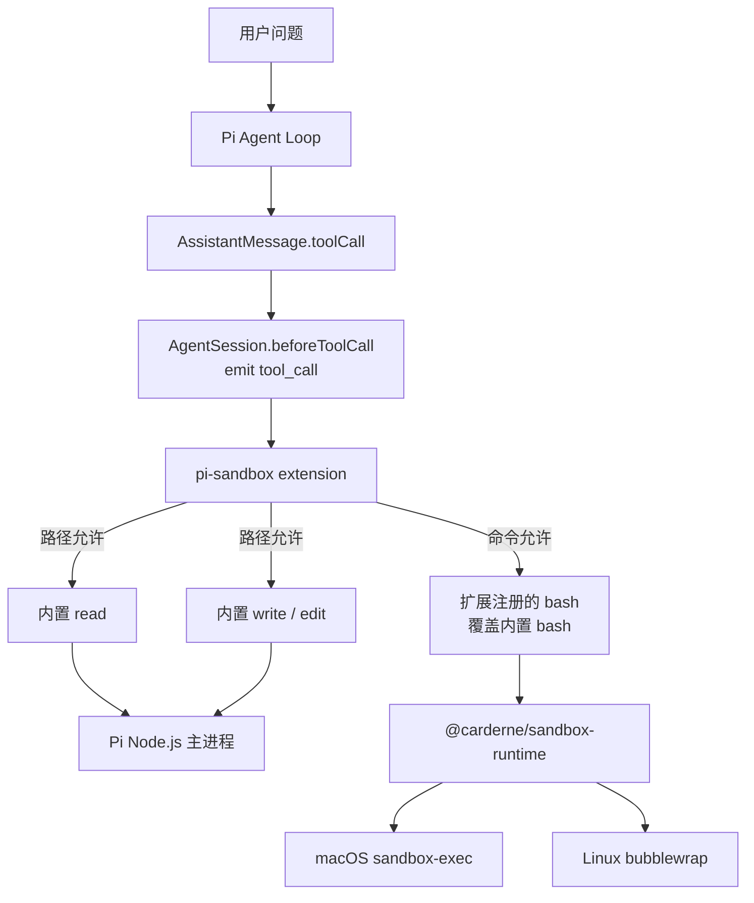
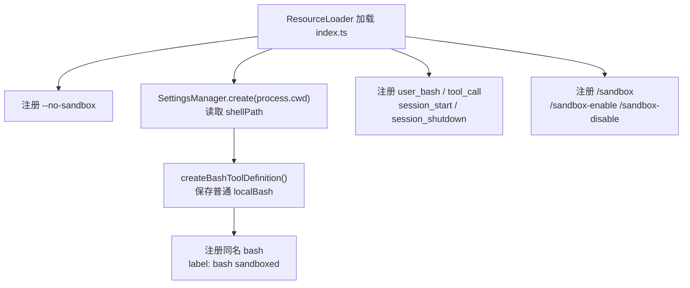
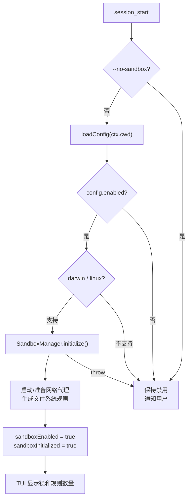
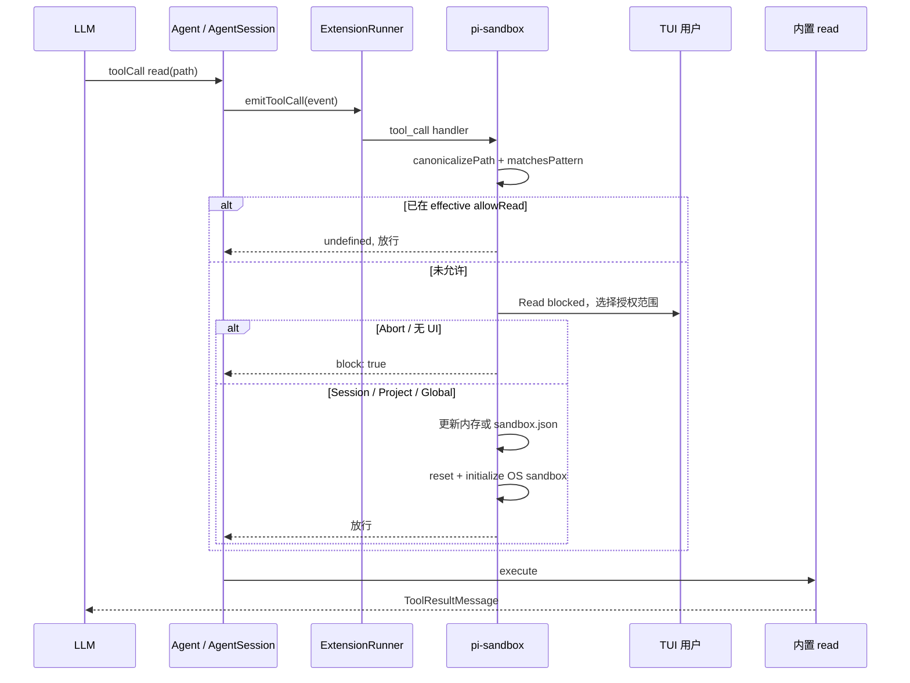
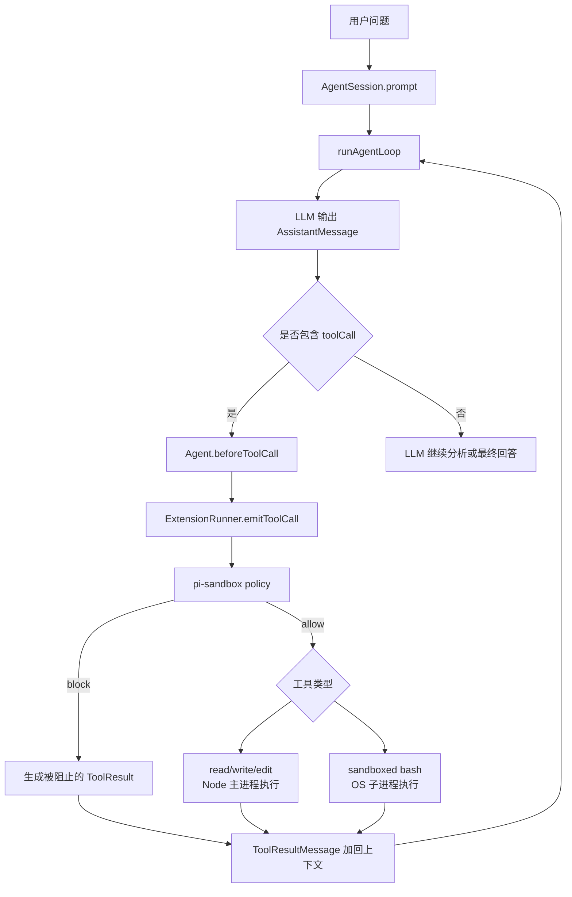
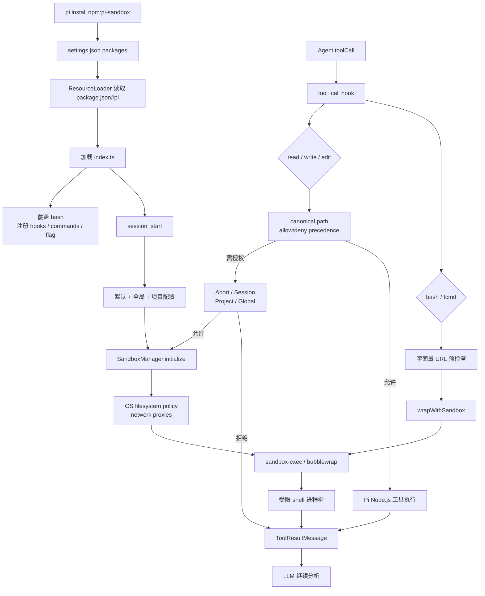

# pi-sandbox 源码 Onboarding

> 适合读者：已经理解 Pi 的扩展系统、`AgentSession`、工具执行和事件机制，希望理解 Pi 如何为文件和命令执行增加安全边界。

## 1. 先用一句话理解它

`pi-sandbox` 是一个 Pi 扩展：它用操作系统级沙箱约束 `bash` 子进程的文件系统和网络访问，同时通过 Pi 的 `tool_call` 事件，在 `read`、`write`、`edit` 真正执行前检查路径并询问用户是否授权。

它不是 Docker 容器，也没有把整个 Pi 主进程放入沙箱。

```text
Pi 主进程
  ├─ Agent / AgentSession / 扩展代码：仍在普通 Node.js 进程中
  ├─ read/write/edit：执行前由扩展做策略检查
  └─ bash：启动受 sandbox-exec / bubblewrap 约束的子进程
```

核心设计是“双层保护”：

1. `bash` 使用 OS enforcement，限制整个 shell 子进程树。
2. `read/write/edit` 使用 Pi event hook，因为它们直接运行在 Node.js 主进程里，OS 子进程沙箱覆盖不到。

## 2. 它和 Pi 主体的关系



职责分工：

| 模块 | 负责内容 |
| --- | --- |
| Pi `AgentSession` | 在工具执行前发出 `tool_call`，收到 `{ block: true }` 时阻止工具 |
| Pi extension API | 注册同名 `bash` 工具、flag、slash command 和事件监听器 |
| `pi-sandbox/index.ts` | 配置合并、路径/域名预检查、授权 UI、规则持久化、命令重试 |
| `@carderne/sandbox-runtime` | 生成 OS 沙箱规则、网络代理、包装 shell 命令 |
| macOS | 用 `sandbox-exec` / Seatbelt profile 执行限制 |
| Linux | 用 bubblewrap、网络 namespace 和代理执行限制 |

## 3. `pi install npm:pi-sandbox` 做了什么

这条命令走 Pi 自己的 package manager：

```text
pi install npm:pi-sandbox
  -> package-manager-cli.ts
  -> DefaultPackageManager.installAndPersist()
  -> parseSource("npm:pi-sandbox")
  -> installNpm()
  -> npm install pi-sandbox --prefix <Pi npm root>
  -> addSourceToSettings()
```

默认用户级安装：

- npm 包进入 `~/.pi/agent/npm/` 管理目录。
- `npm:pi-sandbox` 写入 `~/.pi/agent/settings.json#packages`。

项目级安装：

```bash
pi install -l npm:pi-sandbox
```

- npm 包进入 `<cwd>/.pi/npm/`。
- source 写入 `<cwd>/.pi/settings.json#packages`。
- 项目必须通过 Pi 的 project trust 检查。

包清单的关键部分是：

```json
{
  "pi": {
    "extensions": ["./index.ts"]
  }
}
```

所以下次 Pi 创建 `ResourceLoader` 时，会读取 `package.json#pi.extensions` 并加载 `index.ts`。这个包没有额外注册 skill、prompt template 或独立 CLI。

安装和启用是两个概念：包安装后扩展会被加载，但最终是否启用沙箱还取决于：

- `sandbox.json#enabled`。
- 是否传入 `--no-sandbox`。
- 当前平台是否是 macOS/Linux。
- `SandboxManager.initialize()` 是否成功。

## 4. 扩展加载阶段做了什么

入口是：

```ts
export default function (pi: ExtensionAPI) {
  // 注册 flag、工具、命令和事件监听器
}
```



这里先创建了一个普通的 `localBash`：

```ts
const localBash = createBashToolDefinition(localCwd, {
  shellPath: userShellPath,
});
```

随后扩展注册另一个名字仍为 `bash` 的工具：

```ts
pi.registerTool({
  ...localBash,
  label: "bash (sandboxed)",
  async execute(...) { ... }
});
```

Pi 构建工具 registry 时先放入内置工具，再用扩展工具按名称 `set()`，因此扩展注册的 `bash` 会覆盖内置 `bash` 的执行定义。工具名和参数 Schema 保持不变，模型仍然只看到一个 `bash`。

保留 `localBash` 是为了两种情况：

- 沙箱未启用或初始化失败时回退到普通本地 bash。
- 复用 Pi 原本的输出流、截断、timeout 和 renderer 行为。

## 5. `session_start` 才真正初始化沙箱

扩展加载时只完成注册。真正启动 OS 沙箱发生在：

```ts
pi.on("session_start", async (_event, ctx) => { ... });
```

执行顺序：



初始化传入的配置包括：

- `network`。
- `filesystem`。
- `ignoreViolations`。
- `enableWeakerNestedSandbox`。
- `allowBrowserProcess`。
- 固定的 `enableWeakerNetworkIsolation: true`。
- 一个判断 host 是否在 allowed domains 中的 callback。

初始化成功后，footer/status 显示当前允许域名数和可写路径数。

### 初始化是 fail-open

如果缺少依赖、平台不支持或初始化抛错，代码会：

```ts
sandboxEnabled = false;
ctx.ui.notify("Sandbox initialization failed: ...", "error");
```

已注册的 `bash` 随后走 `localBash.execute()`，即普通非沙箱执行。Pi 不会因为沙箱失败而停止启动。

因此在安全敏感环境中，不能只看“扩展已安装”，还必须确认 UI 的锁状态以及 `/sandbox` 显示为启用。

## 6. 配置如何加载和合并

配置位置：

1. 全局：`<agentDir>/sandbox.json`，通常是 `~/.pi/agent/sandbox.json`。
2. 项目：`<cwd>/.pi/sandbox.json`。

合并顺序：

```text
DEFAULT_CONFIG
  <- global config
  <- project config
```

项目配置优先级最高。

`deepMerge()` 只对 `network` 和 `filesystem` 做一层对象合并：

```ts
result.network = { ...base.network, ...overrides.network };
result.filesystem = { ...base.filesystem, ...overrides.filesystem };
```

这意味着数组不是累加，而是整项替换。例如项目配置一旦写了 `filesystem.allowWrite`，就替换全局 `allowWrite` 数组。

配置文件使用原生 `JSON.parse()`，所以必须是严格 JSON。README 示例里的 `//` 只是讲解注释，不能原样保留在实际 `sandbox.json` 中；否则解析失败并打印 warning，该层配置会被忽略。

## 7. 默认策略

源码默认值：

```json
{
  "enabled": true,
  "network": {
    "allowedDomains": [
      "npmjs.org",
      "*.npmjs.org",
      "registry.npmjs.org",
      "registry.yarnpkg.com",
      "pypi.org",
      "*.pypi.org",
      "github.com",
      "*.github.com",
      "api.github.com",
      "raw.githubusercontent.com"
    ],
    "deniedDomains": []
  },
  "filesystem": {
    "denyRead": ["/Users", "/home"],
    "allowRead": [".", "~/.config", "~/.local", "Library"],
    "allowWrite": [".", "/tmp"],
    "denyWrite": [".env", ".env.*", "*.pem", "*.key"]
  }
}
```

含义：

- 默认允许常见 npm、PyPI、GitHub 域名。
- broad deny `/Users` 和 `/home`，再用 `allowRead` 挖出当前项目等可读区域。
- 只允许写当前项目和 `/tmp`。
- 即使位于可写项目内，也保护 `.env`、密钥等模式。

仓库根部的 `sandbox.json` 是更宽松的浏览器兼容示例，不是内置默认值。它开放 Chrome 路径、local binding、全部 Unix sockets 和多个缓存目录。README 明确提醒这些设置会扩大攻击面。

## 8. 读写规则为什么优先级相反

### Read：allowRead 覆盖 denyRead

OS runtime 的读取模型是“先广泛 deny，再精确 allow”：

```text
denyRead:  ["/Users"]
allowRead: ["."]
```

表示拒绝读取用户目录的大部分内容，但允许读取当前项目。扩展对 Pi `read` 工具采用更直观的判断：只要目标不在 effective `allowRead` 中就提示；用户授权后把具体路径加入 `allowRead`，从而覆盖 broad deny。

所以 `denyRead` 在交互层不是不可突破的 hard deny。

### Write：denyWrite 覆盖 allowWrite

写入模型是“先 allow 目录，再在目录中挖出绝对禁止区域”：

```text
allowWrite: ["."]
denyWrite:  [".env", "*.pem"]
```

写 `.env` 时，即使 `.` 已允许，也会直接 block，不弹授权框。只有用户手动编辑配置移除对应 `denyWrite` 才能放行。

| 操作 | 不在 allow 中 | 命中 deny |
| --- | --- | --- |
| read | 弹窗，授权可覆盖 | 仍可通过授权加入 allowRead |
| write/edit | 弹窗，授权可加入 allowWrite | 硬阻止，不弹窗 |
| bash 文件操作 | OS 层阻止，特定写错误可弹窗重试 | OS 层继续阻止 |

## 9. 路径匹配如何防止简单绕过

Pi 主进程中的路径检查不是直接比较用户输入字符串，而是先 canonicalize：

1. 展开开头的 `~`。
2. 转成绝对路径。
3. 对已存在路径执行 `realpathSync.native()`，解析 symlink。
4. 对尚不存在的写入目标，向上找到最近的已存在父目录，解析父目录 symlink，再拼回末尾路径。

这样可以降低通过 `../` 或已有 symlink 绕过 allow/deny 的风险。

无 wildcard 的规则使用目录边界前缀：

```text
/work/app 匹配 /work/app/src/a.ts
/work/app 不匹配 /work/application
```

包含 `*` 时，扩展把它转换为锚定正则。这里不是 minimatch/glob 库，`*` 被转换为 `.*`，语义比 shell glob 更简单，也可能跨目录分隔符。配置模式最好保持明确并通过实际命令验证。

## 10. `read` 工具的完整流程



`tool_call` 发生在工具真正执行之前。Pi 的 `AgentSession.beforeToolCall` 调用所有 extension handlers，任意 handler 返回 `{ block: true }` 就提前终止执行。

没有 UI 时，`showPermissionPrompt()` 直接返回 `abort`，所以未预先允许的路径不会在 headless 模式自动通过。

## 11. `write` / `edit` 工具的完整流程

处理顺序非常重要：

```text
canonicalize path
  -> 先检查 denyWrite
     -> 命中：立即 block，不询问
  -> 再检查 allowWrite
     -> 已允许：放行
     -> 未允许：询问用户
```

用户选择 project/global 后，扩展直接在 Pi 主进程中更新配置文件：

- Project：`<cwd>/.pi/sandbox.json`。
- Global：`~/.pi/agent/sandbox.json`。

这些配置写操作有意不经过 bash sandbox，否则沙箱将无法持久化新的授权规则。

## 12. `bash` 为什么要覆盖内置工具

普通 Pi bash 的核心是：

```ts
spawn(shell, [...args, command], ...)
```

扩展仍使用 Pi 的 `createBashToolDefinition()`，但替换其 `BashOperations.exec`：

```ts
const wrappedCommand = await SandboxManager.wrapWithSandbox(command, shell);
spawn(shell, [...args, wrappedCommand], ...);
```

也就是说，模型给出的原始 command 先被 runtime 包装成带 OS sandbox 的命令，然后才交给 shell。

```mermaid
flowchart LR
    CALL["Agent 调用 bash"]
    PRECHECK["tool_call<br/>提取字面量 URL 域名"]
    EXEC["扩展 bash.execute"]
    WRAP["SandboxManager.wrapWithSandbox"]
    SPAWN["spawn shell<br/>detached process group"]
    OS["sandbox-exec / bubblewrap"]
    TREE["shell 及其后代进程"]
    OUTPUT["Pi OutputAccumulator<br/>流式输出和截断"]

    CALL --> PRECHECK --> EXEC --> WRAP --> SPAWN --> OS --> TREE --> OUTPUT
```

扩展还保留了 Pi bash 的行为：

- stdout/stderr 合并流式传给 `onData`。
- timeout 后杀死整个 detached process group。
- AbortSignal 取消后杀死整个进程组。
- Linux 命令结束后调用 `SandboxManager.cleanupAfterCommand()` 清理 bwrap mount 文件。
- 最终仍由 Pi 的 bash tool 负责输出截断和 temp file。

## 13. bash 写入失败后的授权和重试

OS 沙箱可能让 shell 返回：

```text
/bin/bash: /outside/file: Operation not permitted
```

扩展执行完后扫描结果文本，尝试提取 blocked path：

```ts
extractBlockedWritePath(outputText)
```

如果识别成功且当前有 UI：

1. 弹出 write permission prompt。
2. 用户选择授权范围。
3. 更新内存/配置。
4. `SandboxManager.reset()` 后按新配置重新 initialize。
5. 若目标仍命中 `denyWrite`，只警告，不重试。
6. 否则完整重跑原 bash command。

这意味着授权后可能执行第二遍整个命令，而不只是失败的那一个 syscall。对非幂等命令要留意：第一次运行在失败点之前可能已产生部分副作用。

写错误识别使用的是特定 shell 输出正则。若某个程序用其他格式报告 EPERM，OS 仍会阻止操作，但扩展可能无法识别路径并展示自动授权/重试 UI。

## 14. 网络限制如何工作

网络有两层：

### 第一层：命令字符串预检查

`extractDomainsFromCommand()` 用正则提取命令中形如：

```text
https://api.example.com/path
```

的字面量域名。未在 effective allowed domains 中时，工具执行前弹窗。

支持：

- 精确域名 `api.example.com`。
- wildcard `*.example.com`，同时匹配根域和子域。
- `*`，允许所有域名，并在 UI 中显示警告。

### 第二层：OS runtime 网络代理

真正的 bash 子进程网络流量由 sandbox runtime 的 HTTP/HTTPS 和 SOCKS 代理/OS network isolation 约束。`deniedDomains` 优先于 allowed domains，在底层 hard block。

第一层主要负责“提前知道要访问哪个域名并询问”；第二层才是安全 enforcement。通过变量拼接、DNS 名、SSH 写法等未出现在字面量 `http(s)://...` 中的目标，可能不会触发 Pi 的预先弹窗，但仍应由底层 allow/deny policy 阻止或放行。

`user_bash` handler 对用户直接输入的 `!cmd` 做相同域名预检查，然后返回 sandboxed `BashOperations`，所以交互式 shell shortcut 也走 OS 沙箱。

## 15. 四种授权选择

遇到可提示的 block 时：

| 选择 | 保存位置 | 生命周期 |
| --- | --- | --- |
| Abort | 不保存 | 本次保持阻止 |
| Session | JS 内存数组 | 扩展 reload 或 Pi 重启前 |
| Project | `.pi/sandbox.json` | 当前项目后续会话 |
| Global | `~/.pi/agent/sandbox.json` | 所有项目 |

Project/Global 需要确认，避免误按一个普通小写键就永久扩大权限。快捷键 `P` / `A` 的大写精确输入可以立即选择；普通导航 Enter 也可完成选择。

Session allowance 保存在扩展闭包中的三个数组：

```ts
sessionAllowedDomains
sessionAllowedReadPaths
sessionAllowedWritePaths
```

它们不会写入 session JSONL，也不会作为 Agent message 进入模型上下文。`/sandbox` 可以让用户查看它们，但 Agent 没有一个专门工具可以读取或直接修改这些数组。

每次授权后都要重新初始化 OS sandbox，因为已生成的 Seatbelt/bubblewrap/proxy 规则不会仅靠修改 JS 数组自动更新。

## 16. `session_shutdown` 和运行时命令

关闭 session 时：

```ts
await SandboxManager.reset();
```

用于关闭 runtime 资源和清理状态。错误被忽略，避免影响 Pi 自身退出。

提供三个 slash command：

| 命令 | 作用 |
| --- | --- |
| `/sandbox` | 显示配置路径、网络/文件规则和内存授权 |
| `/sandbox-enable` | 当前运行中重新 initialize 并启用 |
| `/sandbox-disable` | reset runtime，切换为普通 local bash |

还有启动 flag：

```bash
pi --no-sandbox
```

它只影响本次 Pi 运行，不修改配置文件。

## 17. 平台和依赖

### macOS

- 使用系统自带的 `sandbox-exec` / Seatbelt profile。
- 网络通过受限 localhost 通道与 host 代理通信。

### Linux

- 使用 `bubblewrap` 构造 namespace 和 bind mount 文件视图。
- 需要 `bubblewrap`、`socat`、`ripgrep` 等 runtime 依赖。

### Windows

- 代码明确判定为不支持，并关闭 sandbox。

当前 fork 在 macOS 和 Linux 初始化时都检查 `rg` 是否在 Pi 进程继承的 `PATH` 中。终端里 `which rg` 成功但 GUI 启动的 Pi 仍失败，通常是 GUI 父进程环境没有 Homebrew/MacPorts 路径。

## 18. 安全边界：它保护什么

### 可以直接保护

- Agent 调用的 `bash` shell 及其后代进程。
- 用户输入的 `!cmd`。
- Pi 内置 `read` 工具的目标路径。
- Pi 内置 `write` 和 `edit` 的目标路径。
- bash 子进程的 HTTP/HTTPS/TCP 网络访问。
- bash 子进程的文件读写和部分本地 IPC/Unix socket 行为。

### 不会自动保护

- Pi Node.js 主进程本身。
- 模型 Provider 的网络请求。
- 扩展自身用 `fetch()` 发起的请求。
- 其他扩展工具在 Node.js 中直接使用 `fs` 的读写。
- 其他扩展自己 spawn、worker、native addon 或 MCP client 的行为。
- 不叫 `read/write/edit/bash` 的自定义工具，即使它语义上也在访问文件。

`tool_call` hook 只按工具名处理四个已知工具；OS sandbox 只包裹这个扩展注册的 bash operations。因此“安装了 pi-sandbox”不等于“Pi 进程和所有扩展都在一个通用 sandbox 中”。

例如 `pi-mcp-adapter` 自己启动的 stdio MCP Server 不会因为另一个扩展注册了 sandboxed bash 就自动被包裹；要隔离 MCP Server，需要在 MCP 配置中显式使用 sandbox runtime 包装它的 command，或使用其他进程隔离方案。

## 19. 高风险配置

以下配置会明显放宽边界：

### `allowedDomains: ["*"]`

禁用逐域名限制。即使只允许 `github.com` 这类正常域名，也不代表只能访问你的仓库；允许域名通常不检查应用层账号、仓库或请求内容，仍可能成为数据外传通道。

### `allowLocalBinding: true`

允许沙箱进程监听本地端口。开发服务器需要它，但它增加了进程与外部/本机交互的表面积。

### `allowAllUnixSockets: true`

Unix socket 可能连接 Docker daemon、SSH agent、数据库或系统服务。尤其 Docker socket 基本等同于获得很强的宿主控制能力。

### `allowBrowserProcess: true`

为了让 agent-browser/Chrome 工作会开放更多进程、文件和 IPC 需求。仓库示例明确标注这会形成显著安全缺口，不需要浏览器时不应照搬。

### `enableWeakerNestedSandbox: true`

用于受限 Docker 环境中的兼容模式，名字本身就表示隔离更弱。应只在外层已有可信隔离时启用。

### `enableWeakerNetworkIsolation: true`

当前扩展在初始化时无条件传入此值。上游 sandbox-runtime 文档说明，在 macOS 上该模式会允许访问 `com.apple.trustd.agent`，用于兼容某些 Go TLS 程序，但也增加潜在的数据外传路径。安全评估时不能忽略这一固定设置。

## 20. 源码中值得注意的实现细节

这些不是使用主流程，但读源码时很重要。

### 1. 全局配置路径存在两套写法

加载配置使用：

```ts
join(getAgentDir(), "sandbox.json")
```

永久授权写入使用：

```ts
join(homedir(), ".pi", "agent", "sandbox.json")
```

默认环境下两者相同；如果通过 `PI_CODING_AGENT_DIR` 使用自定义 agent dir，Global 授权可能被写入默认目录，而下一次加载从自定义目录读取。这是值得修正或至少验证的边界。

### 2. Bash cwd 在扩展加载时捕获

`localCwd = process.cwd()` 被用于创建普通和 sandboxed bash definition，而路径事件使用 `ctx.cwd`。通常 Pi 从目标项目启动时二者一致；若运行时切换到不同 cwd，需要确认扩展是否 reload，否则 bash 和策略上下文可能不一致。

### 3. reinitialize 没有完整转发高级配置

初次 initialize 会传入 `ignoreViolations`、`enableWeakerNestedSandbox`、`allowBrowserProcess`；授权后的 `reinitializeSandbox()` 只显式转发 `allowBrowserProcess` 和固定的 weaker network flag。

这意味着一次动态授权后的 runtime 配置可能丢失前两个高级选项。若项目依赖它们，应测试授权前后的行为。

### 4. Bash 重试可能重复副作用

原命令执行到被拒绝的位置后，扩展会从头重跑。像“先删除 A，再写 B”这样的命令，A 的操作可能发生两次。

### 5. UI prompt 不是底层 enforcement

域名和 bash write prompt 依赖字符串/错误输出识别；无法识别时 UI 体验会退化，但真正的 OS policy 仍应在 runtime 层执行。不要把“有没有弹窗”当作沙箱是否生效的唯一证据。

## 21. 它如何接入你前面学习的 Agent Loop



`pi-sandbox` 没有改变 ReAct 循环本身。它只在工具执行边界插入 policy，并替换 `bash` 的底层 operations。工具被阻止或执行后的结果仍作为 `ToolResultMessage` 返回模型，由 LLM 决定如何继续。

## 22. 推荐源码阅读顺序

这个扩展只有一个主要源码文件，建议按逻辑区段阅读：

1. `package.json`：确认 Pi 入口和 runtime 依赖。
2. `index.ts:89-177`：默认配置、load/merge。
3. `index.ts:181-272`：域名和路径匹配。
4. `index.ts:274-340`：授权如何写回配置。
5. `index.ts:344-416`：sandboxed `BashOperations`。
6. `index.ts:420-490`：扩展状态与 runtime reinitialize。
7. `index.ts:492-710`：TUI permission prompt 和 allowance。
8. `index.ts:714-899`：bash、user_bash、tool_call 三条拦截链。
9. `index.ts:903-989`：session 生命周期。
10. `index.ts:993-1118`：slash commands 和状态展示。

再对照 Pi 主项目：

1. `packages/coding-agent/src/core/agent-session.ts#_installAgentToolHooks()`。
2. `packages/coding-agent/src/core/extensions/runner.ts#emitToolCall()`。
3. `packages/coding-agent/src/core/tools/bash.ts#createBashToolDefinition()`。
4. `packages/coding-agent/src/modes/interactive/interactive-mode.ts#handleBashCommand()`。

## 23. 最后用一张总图记住



## 24. 一句话总结设计亮点

`pi-sandbox` 的关键不是简单地在 bash 前拼一个命令，而是把 **扩展工具覆盖、Pi 执行前事件、OS 进程隔离、网络代理、路径 canonicalization、交互授权和配置持久化** 组合成一条完整链路；它对常见内置工具提供了实用的最小权限体验，但边界是“受管工具和 bash 子进程”，不是整个 Pi 进程，因此使用时必须同时理解它的覆盖范围、fail-open 行为和宽松配置带来的逃逸面。

## 25. 参考

- 本地扩展源码：`packages/pi-sandbox/index.ts`
- 本地包说明：`packages/pi-sandbox/README.md`
- [pi-sandbox 上游仓库](https://github.com/carderne/pi-sandbox)
- [carderne/sandbox-runtime](https://github.com/carderne/sandbox-runtime)
- [Anthropic sandbox-runtime 架构与安全限制](https://github.com/anthropic-experimental/sandbox-runtime)
