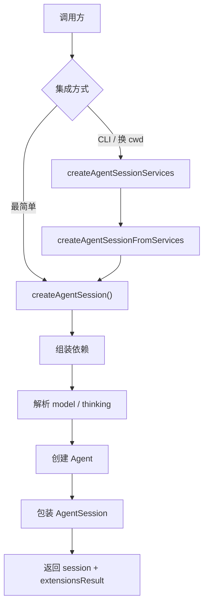
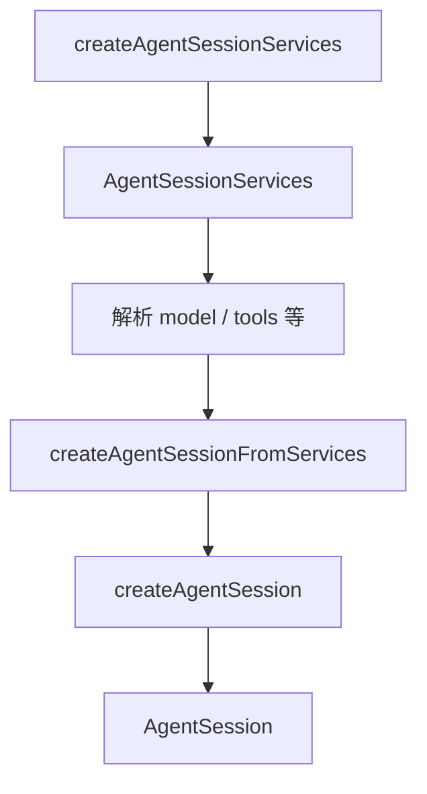

# `sdk.ts` 学习指南

`packages/coding-agent/src/core/sdk.ts` 是 pi coding agent 的 **程序化入口**。外部应用、扩展作者、以及 CLI 底层都通过它创建可对话的 `AgentSession`。

`main.ts` 注释写得很直白：CLI 负责解析参数，**SDK 做重活**。CLI 路径是 `main.ts` → `createAgentSessionServices` → `createAgentSessionFromServices` → `createAgentSession()`；后两者定义在 `agent-session-services.ts`，经再导出链可从 `sdk.ts` 导入。

---

## 整体架构



本文件职责：**把配置选项翻译成一套可运行的 agent 运行时**（模型、工具、扩展、会话持久化、流式调用）。

---

## 文件结构（三块）

| 区域 | 行号 | 职责 |
|------|------|------|
| 类型定义 | 34–93 | `CreateAgentSessionOptions`、`CreateAgentSessionResult` |
| 再导出 | 95–123 | runtime、扩展、工具工厂等公开 API |
| **`createAgentSession()`** | 166–399 | 核心创建逻辑 |

---

## 公开 API

### 类型

**`CreateAgentSessionOptions`**（34–83）：创建 session 的全部可配项。所有字段可选，缺省走内置默认。

| 字段 | 默认行为 |
|------|----------|
| `cwd` | `process.cwd()` 或 `sessionManager.getCwd()` |
| `agentDir` | `~/.pi/agent` |
| `authStorage` | `AuthStorage.create(agentDir/auth.json)` |
| `modelRegistry` | `ModelRegistry.create(authStorage, models.json)` |
| `settingsManager` | `SettingsManager.create(cwd, agentDir)` |
| `sessionManager` | `SessionManager.create(cwd, sessionDir)` |
| `resourceLoader` | 自动建 `DefaultResourceLoader` 并 `reload()` |
| `model` | 从已有 session 恢复，否则 `findInitialModel()` |
| `thinkingLevel` | 从 session / settings 恢复，按模型能力 clamp |
| `tools` / `excludeTools` / `noTools` | 控制内置与扩展工具的启用 |
| `scopedModels` | 交互模式 Ctrl+P 切换的模型列表 |
| `customTools` | 额外注册的工具定义 |
| `sessionStartEvent` | 扩展运行时启动事件元数据 |

**`CreateAgentSessionResult`**（86–93）：

| 字段 | 含义 |
|------|------|
| `session` | 可对话的 `AgentSession` 实例 |
| `extensionsResult` | 已加载扩展（交互模式建 UI 上下文用） |
| `modelFallbackMessage` | session 恢复的模型不可用时的降级提示 |

### 再导出（95–123）

除 `createAgentSession` 外，本文件还作为 **包级 barrel** 再导出：

- `agent-session-runtime.ts` 全部（`AgentSessionRuntime`、`createAgentSessionRuntime` 等）
- 扩展类型：`ExtensionAPI`、`ExtensionFactory`、`ToolDefinition` 等
- 工具工厂：`createReadTool`、`createBashTool`、`createCodingTools` 等
- `withFileMutationQueue`（文件变更串行化）

npm 包 `@earendil-works/pi-coding-agent` 的主要公开面很多从这里出去。

---

## `createAgentSession()` 执行流程

### Phase 1：解析路径与默认依赖（167–184）

```typescript
const cwd = resolvePath(options.cwd ?? options.sessionManager?.getCwd() ?? process.cwd());
const agentDir = options.agentDir ? resolvePath(options.agentDir) : getDefaultAgentDir();
```

按优先级确定 `cwd`，然后创建或复用：

- `AuthStorage` — API key / OAuth 凭据
- `ModelRegistry` — 模型列表与鉴权状态
- `SettingsManager` — 全局 + 项目设置
- `SessionManager` — 会话持久化（`.jsonl`）
- `DefaultResourceLoader` — 扩展、skills、主题、prompt templates

未传 `resourceLoader` 时自动 `reload()`，加载项目资源。

### Phase 2：模型与 thinking 恢复（186–242）

先检查 session 是否已有历史（`buildSessionContext()`）：

1. **有历史 + 未指定 model**：从 session 记录的 `provider/modelId` 恢复；鉴权不可用则设 `modelFallbackMessage`
2. **仍无 model**：`findInitialModel()` — 查 settings 默认，再查 provider 默认
3. **thinkingLevel**：优先 session 分支记录，否则 settings 默认，最后 `DEFAULT_THINKING_LEVEL`；经 `clampThinkingLevel()` 按模型能力截断

新 session 会把初始 model 和 thinking 写入 session 文件，便于 `--continue` 恢复。

### Phase 3：工具启用策略（244–250）

默认启用四个内置工具：`read`、`bash`、`edit`、`write`。

| 选项 | 效果 |
|------|------|
| `tools: ["read", "grep"]` | 白名单，只启用列出的 |
| `noTools: "all"` | 全部禁用 |
| `noTools: "builtin"` | 只禁内置，扩展工具仍可用 |
| `excludeTools: ["bash"]` | 黑名单，在白名单之后应用 |

最终 `initialActiveToolNames` 交给 `AgentSession` 初始化工具注册表。

### Phase 4：创建底层 `Agent`（252–361）

`Agent` 来自 `@earendil-works/pi-agent-core`，是本文件组装的 **LLM 对话引擎**。

关键接线：

| 回调 / 配置 | 作用 |
|-------------|------|
| `convertToLlm` | 把内部消息格式转成 LLM API 格式；`blockImages` 开启时过滤图片 |
| `streamFn` | 实际调模型：`modelRegistry.getApiKeyAndHeaders` 取鉴权，`streamSimple` 发请求；合并重试、超时、attribution headers |
| `onPayload` | 扩展 hook `before_provider_request`，可改写请求体 |
| `onResponse` | 扩展 hook `after_provider_response` |
| `transformContext` | 扩展 hook `context`，可改写发给模型的消息列表 |
| `steeringMode` / `followUpMode` / `transport` | 从 settings 读取队列与传输策略 |
| `sessionId` | 绑定 `SessionManager` 的 session ID |

`extensionRunnerRef` 用 `{ current?: ExtensionRunner }` 引用，因为 `Agent` 创建时扩展 runner 尚未就绪，后续 `AgentSession` 构造完成后再填入。

### Phase 5：恢复或初始化 session 状态（363–375）

- **有历史**：`agent.state.messages = existingSession.messages`；若无 thinking 变更记录则补写
- **新 session**：写入 model 变更和 thinking 变更记录到 `.jsonl`

### Phase 6：包装 `AgentSession` 并返回（377–398）

`AgentSession` 在 `Agent` 之上提供高层 API：`prompt()`、`steer()`、`abort()`、工具执行、扩展绑定、事件订阅等。

传入 `scopedModels`、`customTools`、工具过滤配置、`sessionStartEvent`，返回三者：

```typescript
return { session, extensionsResult, modelFallbackMessage };
```

---

## 三个创建函数与 services / session

### 定义位置与再导出

| 函数 | 定义文件 | 角色 |
|------|----------|------|
| `createAgentSession` | `sdk.ts` | 真正创建 `Agent` + `AgentSession` |
| `createAgentSessionServices` | `agent-session-services.ts` | 只建 cwd 绑定的基础设施，不建 session |
| `createAgentSessionFromServices` | `agent-session-services.ts` | 薄包装，把已有 services 灌入 `createAgentSession()` |

`createAgentSessionServices` 和 `createAgentSessionFromServices` **不在 `sdk.ts` 里实现**，但属于包公开 API，再导出链如下：

```
agent-session-services.ts  （定义）
  ↑ re-export
agent-session-runtime.ts
  ↑ export *（sdk.ts 第 97 行）
sdk.ts → index.ts / main.ts
```

SDK 集成通常只调 `createAgentSession()`；services 两层主要给 CLI 和 `AgentSessionRuntime`（换 cwd / 换 session）用。

### 调用关系



- **`createAgentSessionServices`**：按 cwd 加载 `SettingsManager`、`ModelRegistry`、`DefaultResourceLoader`（扩展、skills、主题），收集 `diagnostics`；处理 CLI 特有的扩展 provider 注册、扩展 flag、project trust reload。
- **`createAgentSessionFromServices`**：不重复实现，把 `services` 各字段 + 已解析的 model/tools/`sessionManager` 传入 `createAgentSession()`。
- **`createAgentSession`**：组装 `Agent`，包装 `AgentSession`，返回可对话实例。

### services 与 session 的区别

| | services（`AgentSessionServices`） | session（`AgentSession`） |
|---|-----------------------------------|---------------------------|
| 是什么 | cwd 绑定的**环境** | 在该环境上跑的**对话实例** |
| 包含 | 鉴权、设置、模型注册表、资源加载器 | 消息历史、当前模型、工具启用、prompt/abort |
| 持久化 | 无（基础设施） | 绑 `SessionManager`（`.jsonl`） |
| 关系 | 备料 | 做菜 |

先 `createAgentSessionServices` 备环境，再对着 services 解析 model/tools，最后 `createAgentSession` 建 session。

### services 为何要重建

**不是全局一套，是绑 cwd 的一套。**

`SettingsManager`（项目级）、扩展、skills、project trust、项目模型配置都读**当前项目目录**。在 A 项目 `pi --resume` 打开 B 项目的 session 时，cwd 从 A 变 B，A 的扩展和设置对 B 无效。

换 session/cwd 时：`createRuntime` 工厂按新 cwd 重建 services，再建新 session；pi 进程不退出。`AuthStorage` 和 `agentDir`（`~/.pi/agent`）全局共享，不随 cwd 重建。

---

## 与 CLI 路径的关系

CLI 不直接调 `createAgentSession()`，而是走更长的工厂链：

```
main.ts
  createRuntime 工厂
    createAgentSessionServices()   // cwd 绑定服务：扩展、模型注册、设置
    createAgentSessionFromServices()  // 薄包装，把 services 灌入 options
      createAgentSession()         // 本文件
    createAgentSessionRuntime()    // 持有工厂，支持换 session / cwd reload
```

**SDK 直接用户**可跳过 services 层，一行 `createAgentSession({ model, sessionManager })` 即可。

**CLI 用户**需要 services 层是因为：扩展加载、project trust、诊断收集、CLI 资源路径解析等逻辑在 **`agent-session-services.ts`**，不在 `sdk.ts` 本文件内。

---

## 典型用法

### 最简

```typescript
const { session } = await createAgentSession();
await session.prompt("Hello");
```

### 内存 session（不持久化）

```typescript
const { session } = await createAgentSession({
  sessionManager: SessionManager.inMemory(),
});
```

### 指定模型与工具

```typescript
const { session } = await createAgentSession({
  model: getModel("anthropic", "claude-sonnet-4"),
  thinkingLevel: "high",
  tools: ["read", "grep", "find"],
});
```

### 事件订阅（类 JSON mode）

```typescript
session.subscribe((event) => {
  if (event.type === "message_update" && event.assistantMessageEvent.type === "text_delta") {
    process.stdout.write(event.assistantMessageEvent.delta);
  }
});
```

更多示例见 `packages/coding-agent/examples/sdk/` 和 `docs/sdk.md`。

---

## 关键设计点

### 默认值优先，逐项可覆盖

每个依赖都有合理默认（`cwd`、`agentDir`、auth、models、settings、session）。集成方可只传关心的字段，其余自动补齐。

### session 恢复优先于 settings 默认

有历史 session 时，model 和 thinking 先从 session 文件恢复，保证 `--continue` 行为一致。恢复失败才 fallback 到 settings / 首个可用模型。

### Agent 与 AgentSession 分层

- **`Agent`**：纯 LLM 对话循环（消息、流式、工具调用协议）
- **`AgentSession`**：pi 特有功能（bash 执行、compaction、扩展、session 持久化、TUI/RPC 绑定）

`sdk.ts` 负责把两者拼在一起，并接好鉴权、设置、扩展 hook。

### `blockImages` 动态生效

`convertToLlmWithBlockImages` 每次调用时读 `settingsManager.getBlockImages()`，中途改设置无需重建 session。

### 与 RPC 文档的对应

RPC 文档建议 Node/TS 用户优先用 `AgentSession` 而非子进程。那个 `AgentSession` 就是本文件的 `createAgentSession()` 产物。

---

## 阅读建议

1. 先读 **`CreateAgentSessionOptions`**（34–83），弄清能配什么。
2. 顺读 **`createAgentSession()`**（166–399），按六个 Phase 走一遍。
3. 对照 **`agent-session.ts`**，看 `AgentSession` 在 `Agent` 上加了什么。
4. 看 **`agent-session-services.ts`**，理解 CLI 为何多一层 services。
5. 跑 **`examples/sdk/01-minimal.ts`** 验证理解。

与 `main.ts` 的关系：CLI 是「配选项的调用方」，`sdk.ts` 是「执行创建的被调用方」。搞清本文件，就搞清了 pi agent 运行时的组装逻辑。
