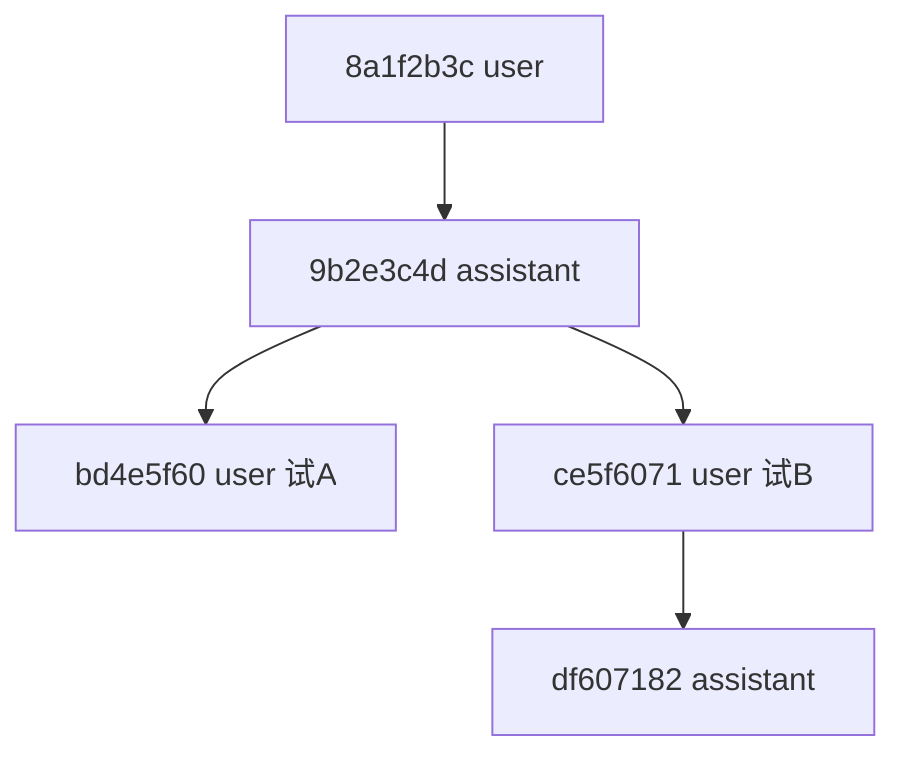

# Pi Session 树结构分析

面向 `packages/coding-agent/src/core/session-manager.ts` 的正式说明：JSONL 如何存对话、树如何分叉、以及 `leafId` / `byId` / `buildSessionContext` 各自职责。

---

## 1. 设计目标

`SessionManager` 把一次对话持久化为 **JSONL 文件**。核心约束：

- **只追加**：历史 entry 不删不改（分支靠新 entry + 换指针）
- **树形**：同一文件可存多条对话分支（`/tree`、`/fork`）
- **投影**：磁盘存「全树」；发给模型的只是 **当前活跃路径** 上的条目

---

## 2. 持久化格式

### 2.1 Header（第一行，不是树节点）

```ts
interface SessionHeader {
  type: "session";
  version?: number;
  id: string;        // session 级 id
  timestamp: string;
  cwd: string;
}
```

### 2.2 SessionEntry（之后每一行）

共同基类：

```ts
interface SessionEntryBase {
  type: string;
  id: string;              // entry 唯一 id（如 8 位 hex）
  parentId: string | null; // 父 entry id；根节点为 null
  timestamp: string;
}
```

常见 `type`：

| type | 含义 |
| --- | --- |
| `message` | user / assistant / toolResult 消息 |
| `model_change` | 切换模型 |
| `thinking_level_change` | 切换思考级别 |
| `compaction` | 上下文压缩摘要 |
| `branch_summary` | 切分支时的摘要 |
| `label` | 给某 entry 打标签 |
| `custom` / `custom_message` | 扩展用 |

真实标识只有 **`id` 字符串**，没有 `u1`、`a1` 这类运行时字段。

---

## 3. 三个核心概念

### 3.1 `id` 与 `parentId`（树的边）

- 每个 entry 有唯一 `id`
- `parentId` 指向父节点；第一条对话 entry 的 `parentId === null`
- 文件按**追加顺序**排列，逻辑结构由 `id`/`parentId` 构成**分叉树**

### 3.2 `leafId`（活跃尖端指针）

`SessionManager` 私有字段 `leafId: string | null`：

| 操作 | 行为 |
| --- | --- |
| **追加** `_appendEntry` | 新 entry 的 `parentId = this.leafId`，然后 `leafId = 新 entry.id` |
| **分支** `branch(id)` | 只把 `leafId` 移到历史某条 entry，不写文件、不删节点；下次 append 从该点长出新分支 |
| **加载文件** `_buildIndex` | 把 `leafId` 设为文件中**最后一条** tree entry 的 id（默认「最后写入 = 当前尖端」） |

`leafId` 是**运行时指针**，一般不单独存盘。

### 3.3 `byId`（索引）

```ts
private byId: Map<string, SessionEntry> = new Map();
```

- **键**：entry 的 `id`
- **值**：完整 `SessionEntry` 对象
- 加载 JSONL 或 `_appendEntry` 时 `byId.set(entry.id, entry)`
- 用途：O(1) 按 id 查找，沿 `parentId` 向上遍历

函数参数里的 **`index`** 与 **`byId` 是同一数据结构**：

```ts
function buildEntryIndex(entries, byId?) {
  if (byId) return byId;  // 复用 SessionManager 缓存
  // 否则临时构建 Map
}
```

`buildSessionPath` 内局部变量叫 `index`，实质就是 `Map<id, SessionEntry>`。

---

## 4. 完整示例

### 4.1 线性对话（无分支）

| 顺序 | id | parentId | type | 内容摘要 |
| --- | --- | --- | --- | --- |
| 1 | `8a1f2b3c` | `null` | message | user: "Hello" |
| 2 | `9b2e3c4d` | `8a1f2b3c` | message | assistant: "Hi" |
| 3 | `ac3f4d5e` | `9b2e3c4d` | message | user: "Fix bug" |

此时 `leafId = "ac3f4d5e"`。

`byId` 内存示意：

```
"8a1f2b3c" → SessionMessageEntry { message: { role: "user", ... } }
"9b2e3c4d" → SessionMessageEntry { message: { role: "assistant", ... } }
"ac3f4d5e" → SessionMessageEntry { message: { role: "user", ... } }
```

活跃路径 `buildSessionPath`：`8a1f2b3c → 9b2e3c4d → ac3f4d5e`。

### 4.2 带分支

在 assistant `9b2e3c4d` 之后走两条路：

| 顺序 | id | parentId | type | 内容 |
| --- | --- | --- | --- | --- |
| 1 | `8a1f2b3c` | `null` | message | user: "重构 auth" |
| 2 | `9b2e3c4d` | `8a1f2b3c` | message | assistant: "方案 A 或 B" |
| 3 | `bd4e5f60` | `9b2e3c4d` | message | user: "试 A" |
| 4 | `ce5f6071` | `9b2e3c4d` | message | user: "改试 B" |
| 5 | `df607182` | `ce5f6071` | message | assistant: "好的，试 B" |

树结构：



- 文件里 **5 条 entry 都在**（只追加）
- `leafId = "df607182"` 时，活跃路径：`8a1f2b3c → 9b2e3c4d → ce5f6071 → df607182`（`bd4e5f60` 不在路径上）
- `branch("9b2e3c4d")` 后 `leafId = "9b2e3c4d"`，再 append 会从该点接新子节点

---

## 5. 核心算法

### 5.1 `buildSessionPath(entries, leafId, byId)`

1. `leaf = byId.get(leafId)`（未指定则用最后一条 entry）
2. 从 `leaf` 出发，反复 `byId.get(current.parentId)` 直到 `parentId === null`
3. 收集后 **reverse** → root 到 leaf 的时间序路径

返回：**原始 entry 列表**（含 compaction、model_change 等，未做压缩裁剪）。

### 5.2 `getSessionContextSettings(path)`

沿路径从 root → leaf 遍历，**后面的覆盖前面的**：

| 条目类型 | 更新 |
| --- | --- |
| `thinking_level_change` | `thinkingLevel` |
| `model_change` | `model` |
| `message` 且 `role === "assistant"` | 从消息上的 `provider` / `model` 更新 `model` |

不能只看 leaf：末端可能是 user 消息、toolResult、compaction 等，不含 model 信息。

### 5.3 `buildContextEntries`（压缩感知）

在活跃路径上，若存在 `compaction` entry（取路径上最后一个）：

| 段落 | 处理 |
| --- | --- |
| 压缩点之前、早于 `firstKeptEntryId` | **丢弃**（由 summary 代表） |
| 压缩点之前、从 `firstKeptEntryId` 起 | **保留**（近期原文） |
| `compaction` 条目本身 | **保留**（含 `summary`） |
| 压缩点之后 | **全部保留** |

无 compaction 时，直接返回完整 `path`。

### 5.4 `buildSessionContext`（给 LLM 的最终包）

```ts
interface SessionContext {
  messages: AgentMessage[];
  thinkingLevel: string;
  model: { provider: string; modelId: string } | null;
}
```

步骤：

1. `buildSessionPath` + `getSessionContextSettings` → thinking / model
2. `buildContextEntries` → 压缩后的 entry 列表
3. `flatMap(sessionEntryToContextMessages)` → `AgentMessage[]`

**调用时机**：resume、压缩后、`/tree` 切分支、换 session——凡「磁盘树」与「内存 agent」需同步时。

相关代码位置：

- `sdk.ts`：启动时 `existingSession = sessionManager.buildSessionContext()`
- `agent-session.ts`：压缩、切分支后 `agent.state.messages = sessionContext.messages`
- `agent-session-runtime.ts`：换 session 后刷新 messages

---

## 6. 写入语义

```ts
_appendEntry(entry) {
  fileEntries.push(entry);
  byId.set(entry.id, entry);
  leafId = entry.id;      // 尖端前移
  _persist(entry);        // 追加一行 JSONL
}

appendMessage(message) {
  // parentId = leafId，然后 _appendEntry
}

branch(branchFromId) {
  leafId = branchFromId;  // 只改指针，不写盘
}
```

---

## 7. 与相邻 API 的区别

| API | 输出 | 用途 |
| --- | --- | --- |
| `getEntries()` | 文件里全部 entry（含所有分支） | 完整树 |
| `getBranch(fromId?)` | 某点到 root 的原始路径 | 不处理压缩裁剪 |
| `buildContextEntries()` | 压缩后的 entry 列表 | 还不是 messages |
| `buildSessionPath()` | 活跃分支原始路径 | 内部步骤 |
| **`buildSessionContext()`** | `messages` + `thinkingLevel` + `model` | **给 LLM / agent 用** |

---

## 8. 概念对照表

| 概念 | 层级 | 作用 |
| --- | --- | --- |
| **SessionEntry** | 数据 | 文件中一行 JSON 对应的结构化对象 |
| **id** | entry 字段 | 节点唯一标识 |
| **parentId** | entry 字段 | 树边，指向父节点 |
| **leafId** | 运行时指针 | 当前活跃对话尖端 |
| **byId** | 内存索引 | `id → SessionEntry`，快速查找与遍历 |
| **index** | 函数内别名 | 与 `byId` 同型的 `Map` |
| **buildSessionPath** | 算法 | root → leaf 原始路径 |
| **buildContextEntries** | 算法 | 压缩感知的 entry 子集 |
| **buildSessionContext** | 算法 | 路径 → LLM 可用的 messages + model + thinking |

---

## 9. 与 settings / services / session 的关系

| 概念 | 管什么 |
| --- | --- |
| **settings** | 持久化偏好（默认模型、transport、retry…） |
| **services** | 绑 cwd 的运行环境（含 `SettingsManager`） |
| **session（AgentSession）** | 可对话实例，内嵌 `SessionManager` 管 JSONL 树 |
| **SessionManager** | 只管「哪条对话、消息历史」；不负责 settings 合并 |

`SessionManager` 的 `model` / `thinkingLevel` 来自 session 文件里的 `model_change`、`thinking_level_change` 和 assistant 消息，与 `settings.json` 的默认值是两套来源；resume 时优先从 session 恢复。

---

## 10. 建议阅读顺序

1. `SessionEntryBase` 与各 entry 类型定义（文件头部）
2. `_appendEntry` / `branch` / `_buildIndex`（写入与加载）
3. `buildSessionPath` → `buildContextEntries` → `buildSessionContext`（投影链）
4. `docs/session-format.md`（官方 JSONL 格式）
5. `test/session-manager/build-context.test.ts`（带分支与压缩的用例）

---

## 11. 一句话总结

Session 文件是 **只追加的 entry 树**：`id`/`parentId` 定义结构，`byId` 支持查找，`leafId` 标记当前走哪条分支；`buildSessionContext` 把「全树 + 当前 leaf」投影成 agent 实际使用的 `messages` + `model` + `thinkingLevel`。
