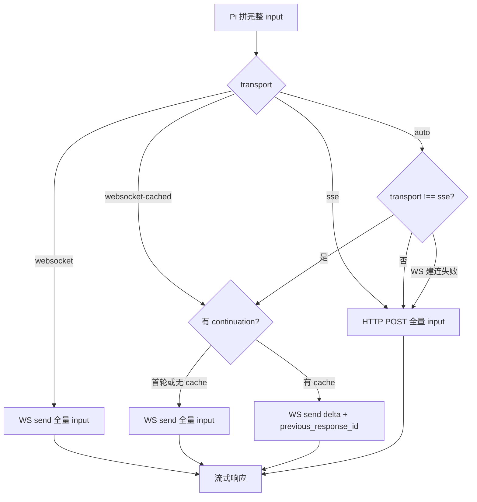

# Transport 传输方式学习指南

`Transport` 定义在 `packages/ai/src/types.ts:98`，用于控制 **OpenAI Codex Responses**（ChatGPT 订阅鉴权）与后端通信时走哪条通道。

```ts
export type Transport = "sse" | "websocket" | "websocket-cached" | "auto";
```

在 coding-agent 中可通过 `settings.json` 的 `transport` 字段配置（默认 `"auto"`），最终传入 `StreamOptions.transport`。

**注意：** 目前仅 `openai-codex-responses` provider 支持；其他 provider 会忽略该选项。

---

## 四种方式一览

| 值 | 协议 | 每轮发什么 | 典型场景 |
|---|---|---|---|
| `sse` | HTTP POST + SSE 流 | 当前完整 `input`（从会话开头拼到本轮） | 最稳；WS 建连失败时的 fallback |
| `websocket` | WebSocket 长连接 | 同上，完整 `input`（未压缩 JSON） | 要 WS 复用连接，但不要增量缓存 |
| `websocket-cached` | WebSocket（同 session 复用） | 首轮全量；之后尽量只发 **delta** + `previous_response_id` | 长对话省带宽/延迟 |
| `auto` | 先 WS，建连失败再 SSE | WS 路径上等同 `websocket-cached` | **默认** |

核心实现：`packages/ai/src/api/openai-codex-responses.ts`

- `transport !== "sse"` → 先试 WebSocket（`processWebSocketStream`）
- `transport === "websocket-cached" \|\| transport === "auto"` → 启用 cached delta（`buildCachedWebSocketRequestBody`）
- WebSocket 在流开始前失败 → 记录 diagnostic，fallback 到 SSE
- 流已开始后再断 → 直接抛错，不 silent fallback

---

## 先说清楚：`input` 长什么样

Codex Responses 的 `input` **不是**简单的 `{ role, content }[]`，而是扁平异构 item 列表，由 `convertResponsesMessages`（`openai-responses-shared.ts`）从 Pi 内部消息转换而来：

| Pi 内部消息 | API `input` item |
|---|---|
| system prompt | `{ role: "developer", content: "..." }` |
| user | `{ role: "user", content: [...] }` |
| assistant 里的 `toolCall` | `{ type: "function_call", call_id, name, arguments }` |
| assistant 里的 `text` | `{ type: "message", role: "assistant", content: [...] }` |
| toolResult | `{ type: "function_call_output", call_id, output }` |

**agent loop 顺序（重要）：**

1. 用户发消息 → API 调用
2. 模型返回 `function_call`（不是直接给最终答案）
3. Pi **本地**执行 tool，得到结果
4. 把 `function_call_output` 塞回上下文 → 再次 API 调用
5. 模型返回 assistant 文本（或继续 tool loop）
6. 等用户下一条消息

所以 **assistant 文本通常在 tool call + tool output 之后**，不是 tool 前面。

---

## 场景示例："读 README" → tool → 回复 → 追问

用户只说一次话，agent 内部可能连续打 **多次 API**（tool loop）。

### 第 1 次 API（用户刚说完）

```json
{
  "input": [
    { "role": "developer", "content": "..." },
    { "role": "user", "content": [{ "type": "input_text", "text": "读 README" }] }
  ]
}
```

模型返回 → `function_call(read, path="README")`  
Pi 本地跑 read tool，拿到文件内容。

### 第 2 次 API（同一 user turn，带上 tool 结果）

```json
{
  "input": [
    { "role": "developer", "content": "..." },
    { "role": "user", "content": [{ "type": "input_text", "text": "读 README" }] },
    { "type": "function_call", "call_id": "call_1", "name": "read", "arguments": "{\"path\":\"README\"}" },
    { "type": "function_call_output", "call_id": "call_1", "output": "# Pi\n..." }
  ]
}
```

模型返回 → assistant 文本 `"内容是..."`  
此时 agent loop 结束，等待用户下一条。

### 第 3 次 API（用户说"总结三点"）

```json
{
  "input": [
    { "role": "developer", "content": "..." },
    { "role": "user", "content": [{ "type": "input_text", "text": "读 README" }] },
    { "type": "function_call", "call_id": "call_1", "name": "read", "arguments": "..." },
    { "type": "function_call_output", "call_id": "call_1", "output": "# Pi\n..." },
    { "type": "message", "role": "assistant", "content": [{ "type": "output_text", "text": "内容是..." }] },
    { "role": "user", "content": [{ "type": "input_text", "text": "总结三点" }] }
  ]
}
```

模型返回 → 总结文本。

---

## 四种 transport 在上述场景怎么发

### `sse`

每轮独立 HTTP POST，`input` = 当前完整上下文（从 0 拼到本轮）。

```
第 1 次 API → input: [developer, user1]                                    (2 items)
第 2 次 API → input: [developer, user1, function_call, function_call_output]  (4 items)
第 3 次 API → input: [developer, user1, fc, fco, assistant_msg, user2]     (6 items)
```

- 请求 body 可走 zstd 压缩（`Content-Encoding: zstd`），见下文「zstd 压缩」
- 每轮是新 POST 发请求；响应在同一条连接上流式返回（见下文「SSE 原理」）

### `websocket`

同 `sessionId` 复用一条 WebSocket（空闲约 5 分钟过期），但**每轮仍发完整 `input`**：

```
第 1 次 → WS send: 2 items 全量
第 2 次 → WS send: 4 items 全量（前面又传一遍）
第 3 次 → WS send: 6 items 全量（前面又传一遍）
```

- 连接复用 → 少握手开销
- payload 不增量 → 轮次越多越大
- 发未压缩 JSON（对齐官方 Codex client）

### `websocket-cached`

首轮全量；服务端记住上下文后，后续发 **delta + `previous_response_id`**：

```
第 1 次 → input: [developer, user1]
         → 响应 response_id = "resp_aaa"

第 2 次 → previous_response_id: "resp_aaa"
         → input: [function_call, function_call_output]   // 只发新增

第 3 次 → previous_response_id: "resp_bbb"
         → input: [assistant_msg, user2]                    // 只发新增
```

delta 计算逻辑（`getCachedWebSocketInputDelta`）：

1. 拿当前完整 `input`
2. 减去「上轮请求 input + 上轮响应 items」已有部分
3. 剩下 = delta

**不能增量时**（改了 system prompt、删了历史、中间消息被改）→ 放弃 cache，退回整段 `input`。

### `auto`（默认）

```
先试 WebSocket（行为同 websocket-cached）
  ├─ 建连成功、流已开始 → 走 cached delta
  └─ 建连/握手失败（流还没开始）→ fallback SSE，改发完整 input
```

例：第 3 次 API 时 WS 挂了（流还没开始）→ 改 SSE POST，发 6 items 全量。

---

## 对比表（第 3 次 API）

| transport | 实际发送 |
|---|---|
| `sse` | 6 items 全量 |
| `websocket` | 6 items 全量（走 WS） |
| `websocket-cached` | 2 items（`assistant_msg` + `user2`）+ `previous_response_id` |
| `auto` | 优先同 cached；WS 失败则 SSE 发 6 items 全量 |

---

## sse 与 websocket：发包行为一致

在「每轮发什么」上，`sse` 和 `websocket` **完全一致**：都发当前完整 `input`（从会话开头拼到本轮）。

差别只在**传输层**：

| | `sse` | `websocket` |
|---|---|---|
| 发请求 | 每轮新 HTTP POST | 同 `sessionId` 复用 WS 连接 |
| 发内容 | 完整 `input` | 完整 `input` |
| 收响应 | POST 的 response body 上 SSE 流式读 | 同 socket 上收 frame |
| 请求压缩 | 支持 zstd | 未压缩 JSON |

所以 WS **不是**为解决「上下文变大」设计的，主要是**少握手、连接复用**。

---

## 长对话会越来越慢吗？

**会**——若锁死 `sse` 或 `websocket`：

1. **上传变慢**：body 字节数随历史线性增长
2. **模型处理变慢**：输入 token 越多，首 token 延迟越高、费用越高
3. **tool loop 放大**：一轮用户话可能连打多次 API，每次都带当时完整上下文

### Pi 的缓解机制

| 机制 | 作用 |
|---|---|
| **`auto` / `websocket-cached`（默认）** | 首轮全量，之后只发 delta + `previous_response_id`，上传不再线性涨 |
| **compaction** | 上下文快满时把旧消息压成 summary，替换长历史 |
| **SSE zstd 压缩** | 压缩 POST body，减上传体积（不解「模型要处理的 token 数」） |
| **Codex `sessionId` + prompt caching** | 服务端缓存前缀；计费可能走 `cacheRead`，客户端仍可能发全量 JSON |
| **context window 上限** | 到顶触发 compaction 或报错，不会无限涨 |

```
sse / websocket     → 每轮全量 → 历史越长越慢
auto / cached       → 上传增量 → 主要慢在「模型算新 token」
compaction          → 应用层砍历史 → 从根本上控 input 大小
```

只有调试或网络环境怪时才建议强制 `sse`；日常用默认 `auto` 即可。

---

## 深入：SSE 原理与普通 POST 的区别

### SSE 是长连接，但只指「响应方向」

SSE（Server-Sent Events）= **一条 HTTP 连接上，服务端持续往客户端推事件**。

Pi 里 Codex 的 SSE 路径，一次 API 调用：

```
客户端                              服务端
  |  POST（带完整 JSON input）  -->  |
  |  <--  HTTP 200，连接保持       |
  |  <--  data: {...}             |  流式 chunk
  |  <--  data: {...}             |
  |  <--  [DONE]                  |
  |  连接关闭                      |
```

- **响应**：长连接，边生成边推（streaming）
- **请求**：每轮仍是新 `POST`，body 里带完整 `input`

### SSE 和普通 POST 不是同一层概念

| 概念 | 层级 | 说什么 |
|---|---|---|
| **POST** | HTTP 方法 | 客户端怎么**发请求**（body 里带数据） |
| **SSE** | 响应格式 | 服务端怎么**回数据**（流式推事件） |

Pi 的 `sse` transport = **POST 发全量 input + SSE 流式收模型输出**，不是和 POST 对立的另一种协议。

与「一次性返回」的普通 POST 对比：

| | 普通 POST（非流式） | POST + SSE（Pi Codex） |
|---|---|---|
| 请求 | POST + JSON body | 一样 |
| 响应 | 等全生成完，一次返回完整 JSON | 连接保持，边生成边推 `data:` 行 |
| 客户端体验 | 干等，然后一次性拿到 | 逐字/逐块看到输出 |
| 连接 | 收完就关 | 流到结束才关 |

类比：普通 POST = 外卖做好了一次端上来；POST + SSE = 菜做好一道上一道。

### SSE 协议要点

响应头示例：

```
Content-Type: text/event-stream
Cache-Control: no-cache
Connection: keep-alive
```

服务端按行推送：

```
data: {"type":"response.output_text.delta",...}

data: {"type":"response.completed",...}

```

客户端用 `fetch` + `ReadableStream` 逐段读 `data:` 行。特点：单向流（客户端再说话需新 POST 或换 WS）、走 HTTP/HTTPS、穿透代理友好。

### 三种传输方式放一起

```
POST（非流式）  : POST 请求 → 完整 JSON 响应
POST + SSE      : POST 请求 → 流式 event 响应   ← Pi 的 sse transport
WebSocket       : 握手后双向帧，请求响应都走同连接
```

### zstd 压缩：模型看不到压缩数据

zstd 只压**请求 body 的传输**，不是让模型「读压缩格式」。

```
Pi 内存: 完整 input JSON 字符串
    ↓ zstdCompressSync（仅 SSE 路径，level=3）
HTTP POST body: 压缩二进制
Header: Content-Encoding: zstd
    ↓ 网络传输（更小、更快）
Codex 服务端: 按 header 自动解压
    ↓
模型收到: 正常 JSON / input items
```

源码注释：*The Codex backend decodes Content-Encoding: zstd*

类比：盒子（zstd）压缩省运费，收件人（服务端）拆盒后看信（JSON）。**模型只看解压后的 JSON。**

WebSocket 路径**不压缩** request body，发未压缩 JSON frame（对齐官方 Codex client）。环境不支持 `zstdCompressSync` 时 SSE 退回明文 JSON。

---

## 整体流程



---

## 在项目中怎么配

### settings.json

```json
{
  "transport": "auto"
}
```

可选值：`"sse"` | `"websocket"` | `"websocket-cached"` | `"auto"`

相关字段：

| 字段 | 默认 | 作用 |
|---|---|---|
| `transport` | `"auto"` | 传输方式 |
| `httpProxy` | — | 代理（HTTP + HTTPS） |
| `httpIdleTimeoutMs` | — | HTTP 空闲超时；`0` 禁用 |
| `websocketConnectTimeoutMs` | `15000` | WS 握手超时；`0` 禁用 |

定义位置：`packages/coding-agent/src/core/settings-manager.ts` → `Settings.transport`

类型别名：`TransportSetting = Transport`（来自 `@earendil-works/pi-ai`）

### 代码层

```ts
// packages/ai/src/types.ts
interface StreamOptions {
  transport?: Transport;
  sessionId?: string;  // WS 连接复用 + cached context 依赖
  // ...
}
```

`sessionId` 对 `websocket` / `websocket-cached` / `auto` 很重要：同 session 复用连接，cached 模式才能记住 continuation。

---

## 怎么选

| 场景 | 推荐 |
|---|---|
| 默认 / 日常 | `auto` |
| 代理或网络环境怪、要最稳 | `sse` |
| 长会话、想少传历史 | `websocket-cached` 或 `auto` |
| 要 WS 但每轮全量（少见） | `websocket` |

---

## 关键源码索引

| 文件 | 内容 |
|---|---|
| `packages/ai/src/types.ts:98` | `Transport` 类型定义 |
| `packages/ai/src/api/openai-codex-responses.ts:271` | transport 选择与 WS/SSE 分支 |
| `packages/ai/src/api/openai-codex-responses.ts:1312` | `getCachedWebSocketInputDelta` |
| `packages/ai/src/api/openai-codex-responses.ts:1334` | `buildCachedWebSocketRequestBody` |
| `packages/ai/src/api/openai-codex-responses.ts:1391` | `useCachedContext` 判断 |
| `packages/ai/src/api/openai-codex-responses.ts:202` | `compressRequestBodyZstd`（SSE 请求压缩） |
| `packages/coding-agent/src/core/compaction/compaction.ts` | 上下文 compaction |
| `packages/ai/src/api/openai-responses-shared.ts:90` | `convertResponsesMessages`（input 转换） |
| `packages/coding-agent/src/core/settings-manager.ts:190` | `Settings.transport` |
| `packages/coding-agent/docs/settings.md` | 用户文档 |

---

## 一句话总结

Pi 内部每轮都会拼完整上下文。`sse` / `websocket` 原样全发且会随历史变慢；`websocket-cached` / `auto` 在 WebSocket 上尽量只发新增尾巴。SSE = POST 发请求 + 流式收响应；zstd 只压传输，服务端解压后模型才处理。
